# Getting Started

This Getting Started tutorial describes how to record a test for the [TestCafe Studio sample page](http://devexpress.github.io/testcafe/example), run the test and analyze the results.

The tutorial consists of the following sections:

* [Install TestCafe Studio](#install-testcafe-studio)
* [Record Test Actions](#record-test-actions)
* [View the Recorded Test](#view-the-recorded-test)
* [Add an Assertion to the Test](#add-an-assertion-to-the-test)
* [Run the Test](#run-the-test)
* [View the Test Results](#view-the-test-results)

## Install TestCafe Studio

You can install TestCafe Studio on MacOS, Windows or Linux. See [Installation](../guides/installation.md) for more information.

## Record Test Actions

1. First, create a [test directory](../guides/organize-tests.md#test-directory) to store your tests. Then go to TestCafe Studio, open the **File** menu, click **Open Tests Directory** and navigate to the created directory. You can view the directory's contents in the [Explorer](../user-interface/explorer-panel.md) panel.

    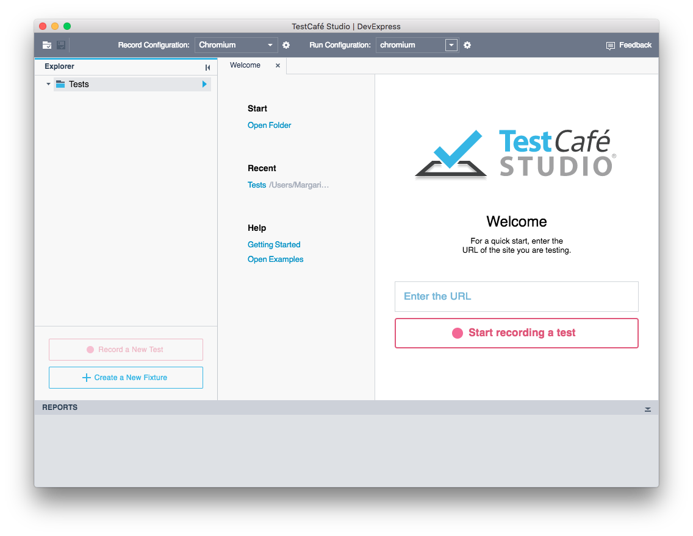

2. Create a [fixture](../guides/record-tests/README.md#create-fixtures) for the sample webpage tests. To do this, click the  **Create a New Fixture** button in the **Explorer** panel. This invokes the **New Fixture** dialog where you can specify the fixture name and the tested page's URL ([http://devexpress.github.io/testcafe/example](http://devexpress.github.io/testcafe/example)).

    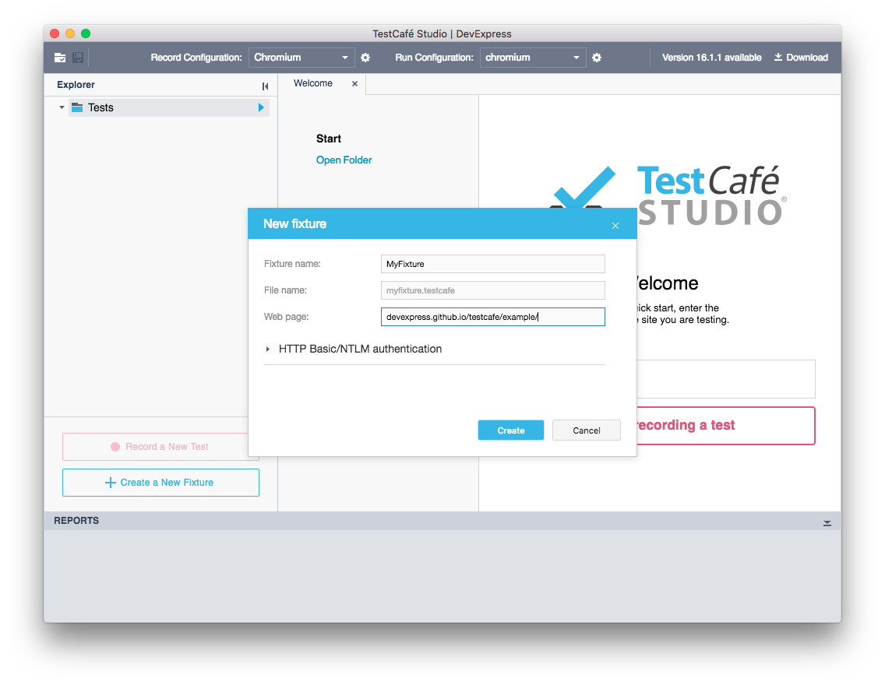

    Click **Create**. The new fixture is added to the test directory.

3. Start recording a test. To do this, click the  **Record a New Test** button in the **Explorer** panel. TestCafe Studio launches the default browser with the tested site and starts recording your activity on the webpage.

    Perform the following actions on the webpage:

    1. Enter a name in the **Your name** field.
    2. Check the **Support for testing on remote devices** and **Advanced traffic and markup analysis** checkboxes.
    3. Click the **Submit** button.

    TestCafe Studio adds your actions to the test. You can view the recorded actions in TestCafe Studio at any time.

    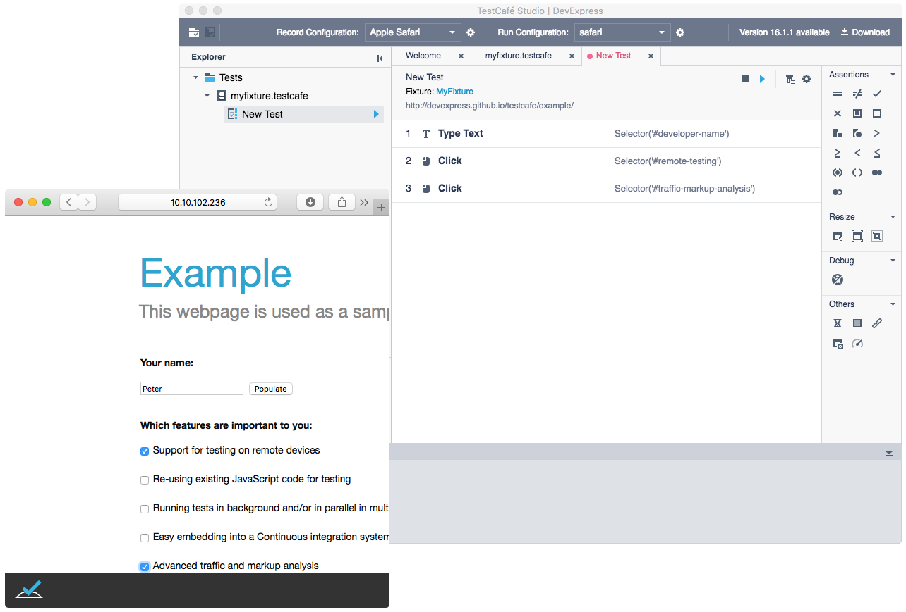

4. Close the browser window or click  on the toolbar to stop the recording.

## View the Recorded Test

TestCafe Studio displays the recorded test in the [Test Editor](../user-interface/test-editor.md).

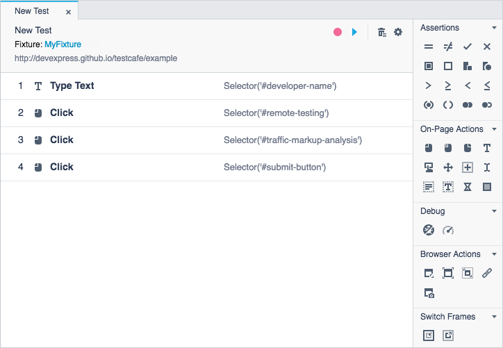

The editor allows you to modify the test: reorder and delete actions, add new actions, modify actions' parameters. For example, you can change the [Element Selector](../guides/record-tests/test-actions/on-page-actions/action-parameters.md#element-selector) parameter that specifies the action's target element: select an alternative selector from auto-generated selectors or enter your own.

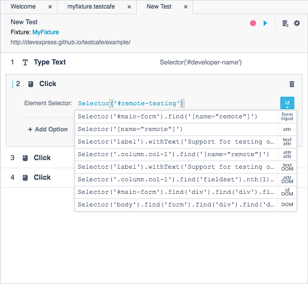

## Add an Assertion to the Test

TestCafe Studio provides a set of [assertions](../guides/record-tests/test-actions/assertions.md) to perform verification actions in tests. You can add assertions during or after recording.

This step adds an [Equals](../guides/record-tests/test-actions/assertions.md#equals) assertion to the test. The assertion should check if the **Thank you** page displays the name you entered as **Your name**. Follow the steps to add the assertion:

1. Click the  **Record test actions** button on the **Test Editor**'s toolbar to continue recording the test. TestCafe Studio replays the previous test actions and waits for new ones.

2. Click the  button in the **Actions** panel's **Assertions** section to add the assertion to the test. TestCafe Studio adds the assertion to the end of the test and allows you to specify the assertion's parameters.

3. Select an element whose property you are going to check. To do this, click the  button next to the **Actual** field. This displays the tested webpage where you can select the target element. Hover the mouse cursor over the page header that says *'Thank you, ...'*. The selector popup displays the [Element Selector](../guides/record-tests/test-actions/on-page-actions/action-parameters.md#element-selector) that identifies the page header.

    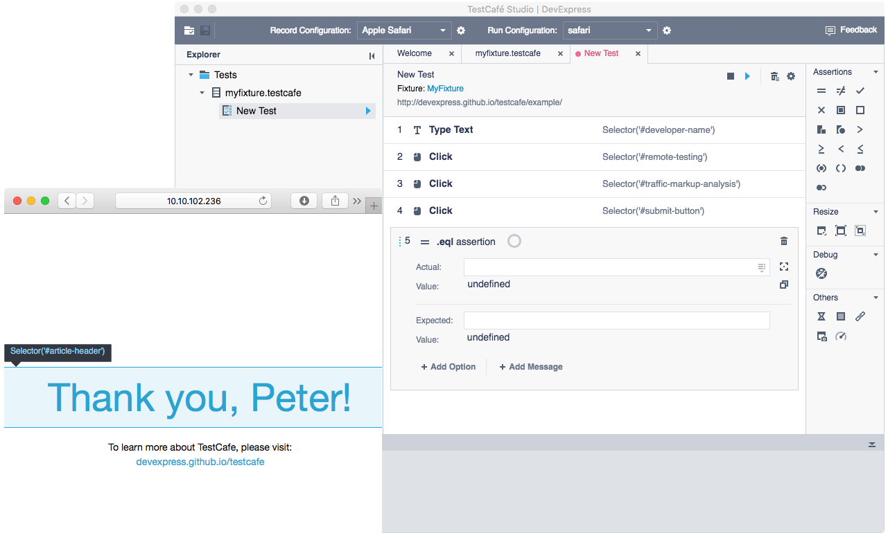

    Click the page header to add the selector to the **Actual** field.

4. Select the property you want to verify from the list.

    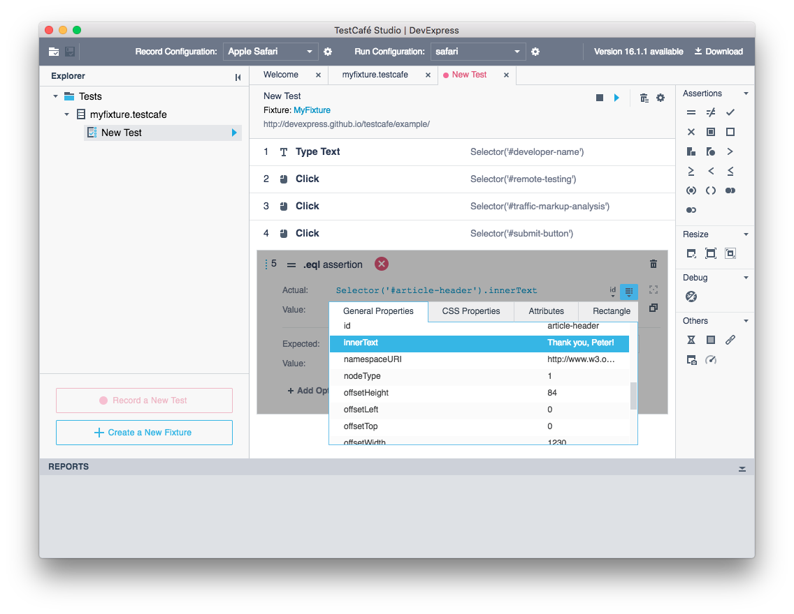

    TestCafe Studio generates the element property expression and adds it to the **Actual** field. It also evaluates the specified expression and shows the result in the **Value** field.

5. Specify the object property's expected value in the **Expected** field. You can click the  button to add the current property value to the field.

    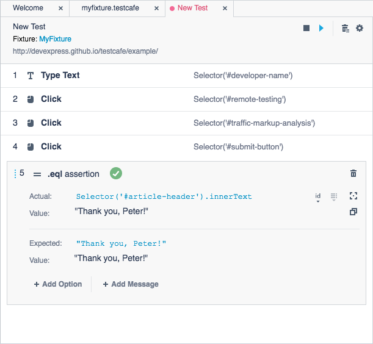

6. Click the  button on the **Test Editor**'s toolbar to stop the recording.

 > If add the assertion when the recording is stopped, you can enter the assertions' parameters only manually. The element picker, property list, and assertion status' verification are available only during recording.

## Run the Test

TestCafe Studio can run tests in all popular browsers.
It automatically detects browsers on the local computer and creates test [run configurations](../guides/run-tests.md#run-configurations) for them.
You can open the **Run Configuration** drop-down menu on the toolbar to view the available configurations.

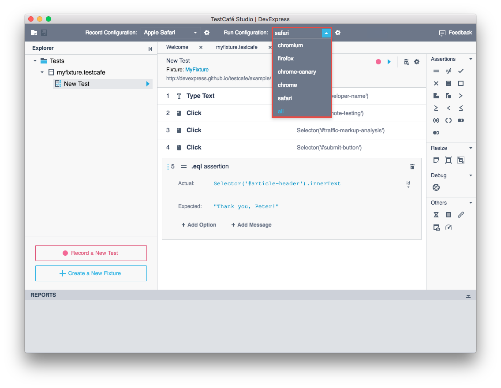

To view configurations' details, modify them or create your own configuration, click  next to the menu and use the invoked [Run Configurations](../user-interface/run-configurations-dialog.md) dialog.
You can select one or several browsers for each configuration and specify additional test run options.

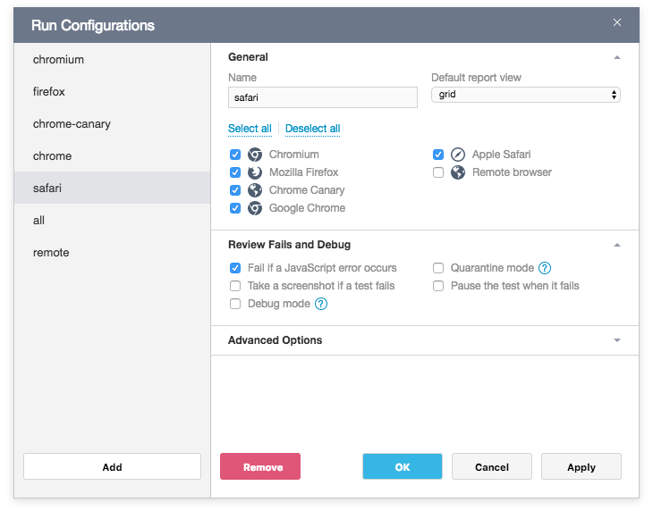

To run the recorded test in all the installed browsers, use the *all* configuration. Select it in the **Run Configuration** menu and click the  **Run test** button on the toolbar. TestCafe Studio executes the test in several browsers simultaneously.
The [Reports panel](../user-interface/reports-panel.md) displays the test's progress.

## View the Test Results

The [Reports panel](../user-interface/reports-panel.md) displays the test result after the test is completed. To see a complete test report in the [Report view](../user-interface/report-view.md), click the corresponding entry in the **Reports** panel.

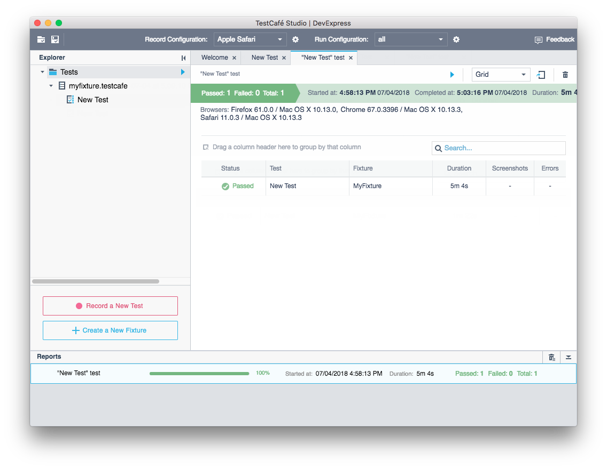
