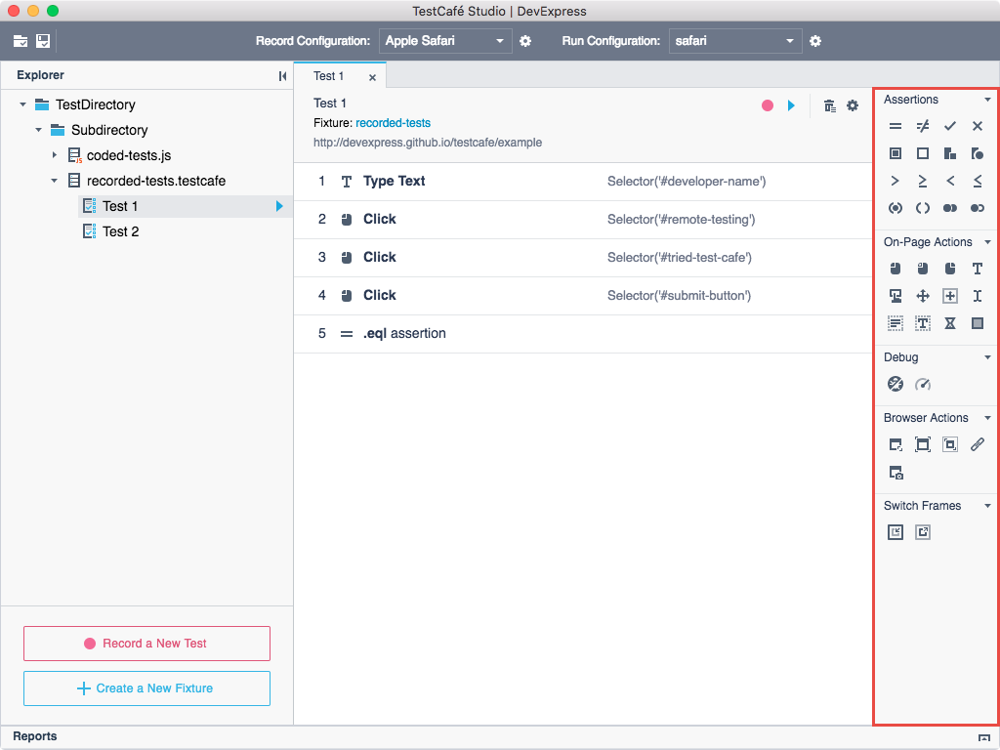
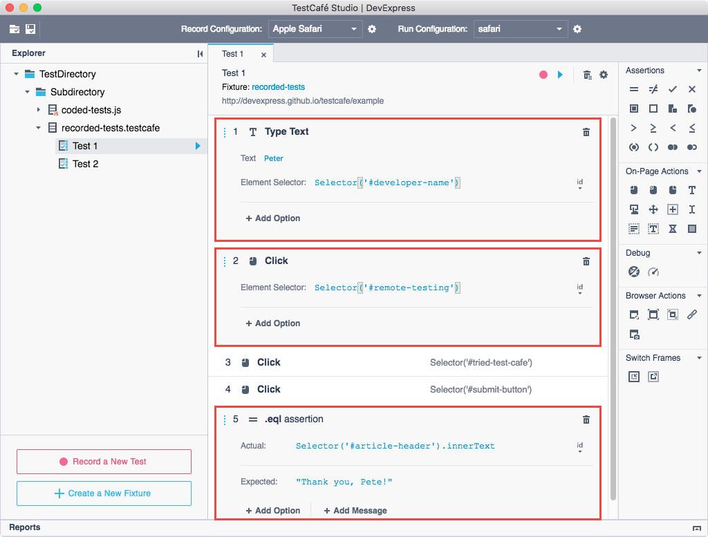
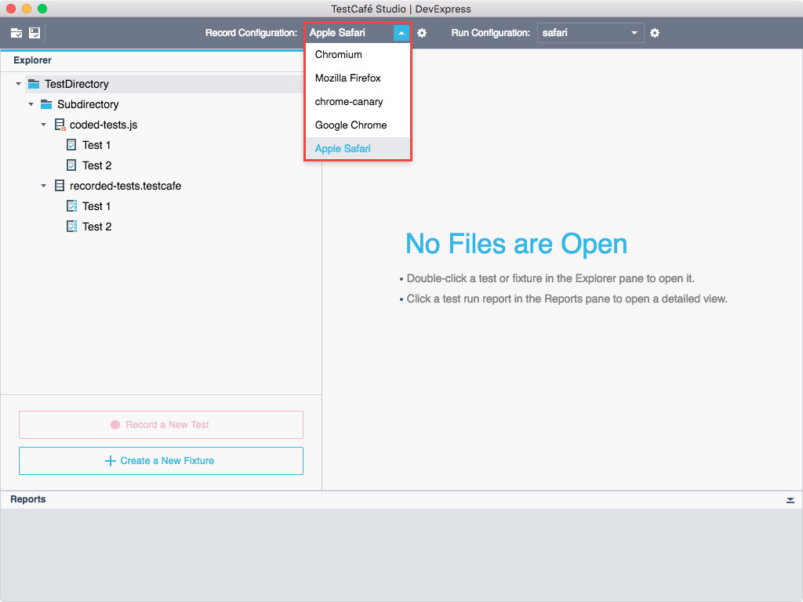
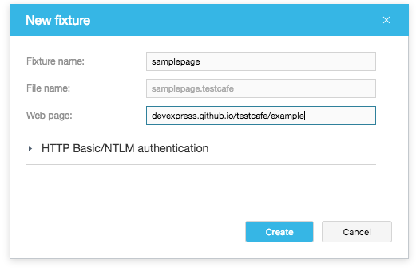
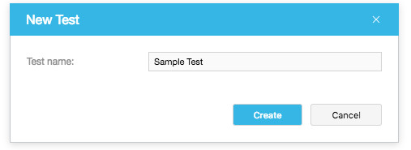

# Record Tests

Tests consist of [test actions](test-actions/README.md) to be performed with a tested page.

TestCafe Studio provides a set of actions that you can use in tests. These actions are organized into different categories in the [Test Editor](../../user-interface/test-editor.md)'s **Actions** panel. For example, **On-Page Actions** simulate user actions - clicks, key presses, drags, etc. on your tested page. The actions in the **Assertions** category allow you to perform different verifications.

Actions have parameters that enable you to specify a target element and define how the action should be performed.

You can create tests:

* by recording test actions;
* by adding test actions to a test manually in the **Test Editor**.

The following sections provide detailed information about recording tests:

* [Record Configurations](#record-configurations)
* [Create Fixtures](#create-fixtures)
* [Create Tests](#create-tests)
* [Start and Stop Recording](#start-and-stop-recording)
* [During Recording](#during-recording)
* [Modify Tests](#modify-tests)

## Record Configurations

You can record a test in any local browser. TestCafe detects browsers on the local computer and adds them to the **Record configuration** drop-down menu. Before recording a test, select the record configuration from the list.

You can modify record configuration options in the [Record Configuration](../../user-interface/record-configuration-dialog.md) dialog. To open the dialog, click the  button next to the **Record configuration** menu on the toolbar.

## Create Fixtures

Recorded tests should be organized into categories called **fixtures**. A fixture contains tests for a single target URL, and you usually have one fixture per website page.

Follow the steps below to create a fixture:

1. Open a [test directory](../organize-tests.md#test-directory).
2. Do any of the following:
    * In the **Explorer** panel, click **Create a New Fixture** button.
    * Right-click a test directory or subdirectory in the **Explorer** panel and select **New Fixture** from the context menu.
    This opens the **New Fixture** dialog.
3. Specify the fixture name and the tested page’s URL.

    

4. Click **Create**.

TestCafe Studio creates the fixture and opens it in the [Fixture Editor](../../user-interface/fixture-editor.md).

You can start recording tests after the fixture is created.

> TestCafe Studio automatically creates a new fixture if you start recording a test from the [Welcome Page](../../user-interface/welcome-page.md).

## Create Tests

> You can create a test manually or you can skip this step and go to recording. When you start recording, TestCafe Studio automatically creates a new test. See [Start and Stop Recording](#start-and-stop-recording).

To create an empty test:

1. Open the context menu for a desired fixture in the **Explorer** panel and select **New Test**.
2. In the **Create Test** dialog, specify the test name and click **Create**.

    

TestCafe Studio creates a test with the specified name and opens it in the [Test Editor](../../user-interface/test-editor.md). Next, add actions to the test from the **Actions** panel manually or record them. To start recording, click the  **Record test actions** button on the **Test Editor**'s toolbar.

## Start and Stop Recording

Do any of the following **to start recording** a new test:

* Select a fixture in the **Explorer** panel and click the  **Record a New Test** button.
* Click the  **Record a new test**  button on the **Fixture Editor**'s toolbar.
* Click the  **Start recording a test** button on the **Welcome** page.

TestCafe Studio creates a new test, adds it to the fixture and starts recording test actions. See [During Recording](#during-recording).

**To stop recording**, close the browser or click the  button on the [Test Editor](../../user-interface/test-editor.md)'s toolbar.

**To continue recording**, click the  **Record test actions** button on the **Test Editor**'s toolbar. TestCafe plays back the previous actions and waits for new ones.

## During Recording

When TestCafe Studio starts recording, it launches the browser specified in the **Record configuration** list and starts recording your activity on the tested page.

You can do the following during test recording:

* Record on-page actions (clicks, drags, key presses, etc.) by interacting with the web page. TestCafe Studio adds these actions with their necessary parameters to the test.

* Add actions from the **Actions** panel to the test. To do this, click a desired action in the **Actions** panel. The action is added to the end of the test. Then specify the action parameters.

    When you add an on-page action or assertion, you can visually select a target element on the tested page. To do this, click the  button in the action parameters' area and click an element on the page.

    When you add an assertion, you can also choose a property from the auto-generated property list and see the assertion's status.

* View and modify the recorded actions. See [Modify Tests](#modify-tests).

### Modify Tests

You can view and modify recorded tests in the [Test Editor](../../user-interface/test-editor.md) during and after recording.

You can perform the following tasks:

* View and [modify action parameters](../../user-interface/test-editor.md#modify-actions-parameters).
* [Add new actions](../../user-interface/test-editor.md#add-actions-manually).
* [Re-order](../../user-interface/test-editor.md#change-an-actions-position) and [delete](../../user-interface/test-editor.md#delete-actions) actions.
* [Rename tests](../../user-interface/test-editor.md#rename-tests).

> You cannot visually select target elements for actions if you add or modify the actions after recording- you should specify them manually.
