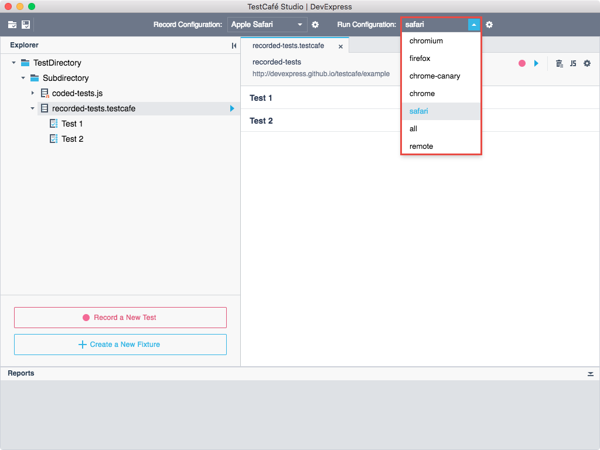
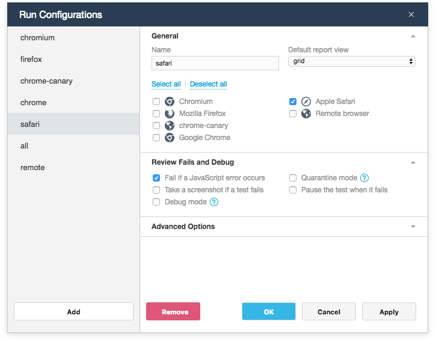
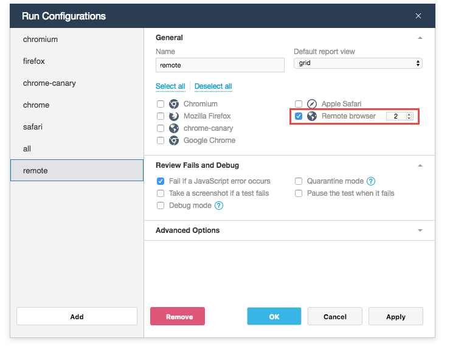
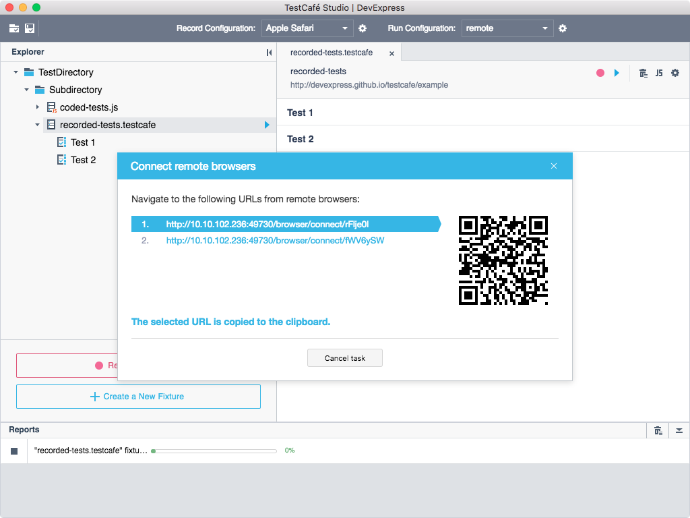
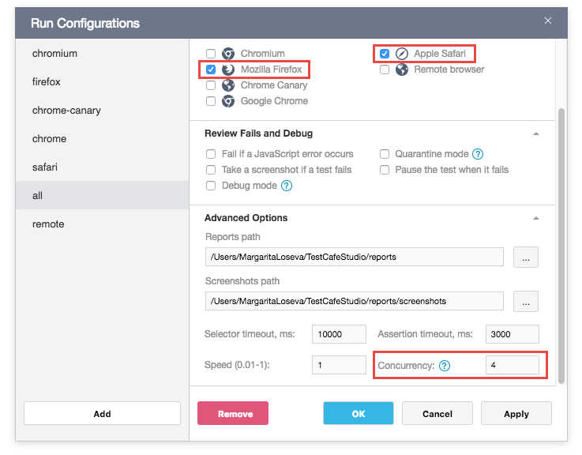

# Run Tests

This topic describes how to execute tests and consists of the following sections:

* [Run Configurations](#run-configurations)
* [Start and Stop Tests](#start-and-stop-tests)
* [Run Tests in Remote Browsers](#run-tests-in-remote-browsers)
* [Concurrent Test Execution](#concurrent-test-execution)

## Run Configurations

TestCafe Studio can run tests in desktop and mobile browsers (see [Supported Browsers](../../references/supported-browsers.md)). TestCafe Studio determines which browsers are installed on the local computer and automatically creates *run configurations* for them. You can view available configurations and switch between them in the **Run Configuration** drop-down menu.

To modify configurations or create a new one, click  and use the [Run Configurations](../user-interface/run-configurations-dialog.md) dialog. You can select one or multiple browsers and specify options that affect test execution for each configuration.

## Start and Stop Tests

> Important! Before running tests, select the run configuration from the **Run Configuration** list.

You can run an entire test directory/subdirectory, a specific fixture, an individual test or a coded test file.

**To run the entire test directory or subdirectory**, click  **Run all tests** next to the directory in the [Explorer](../user-interface/explorer-panel.md) panel.

**To run a fixture**, click  **Run all tests** next to the fixture in the **Explorer** panel or on the [Fixture Editor](../user-interface/fixture-editor.md)'s toolbar.

**To run an individual test**, do any of the following:

* Click  **Run test** on the [Test Editor](../user-interface/test-editor.md)'s toolbar.
* Click  **Run test** next to the test in the **Fixture Editor** or **Explorer** panel.

**To run a coded test's file**, click  **Run test** next to the file in the **Explorer** panel. You can also click  to run test fixtures and individual tests from the [Code Editor](../user-interface/code-editor.md).

**To run several tests** from different fixtures and directories, select the tests in the **Explorer** panel using Shift-click, Ctrl-click, or Command-click, then select **Run tests** from the context menu or click  **Run Tests** next to any selected item.

After starting a test, TestCafe Studio launches the specified browsers and executes tests in them simultaneously. The [Reports panel](../user-interface/reports-panel.md) displays the tests' progress.

Click  in the **Reports** panel **to stop the test**.

TestCafe Studio pauses the test when it fails if the *Pause the test when it fails* option is enabled in the run configuration. To finish the test, click **Finish** in the browser window.

## Run Tests in Remote Browsers

TestCafe Studio allows you to run tests on any device that has network access to the machine where TestCafe Studio is installed.

Follow the steps below to run a test in remote browsers:

1. Create a run configuration for the remote browsers. In the run configuration's settings, select the **Remote browser** checkbox and specify the number of remote browser instances.

    

2. Select the configuration in the **Run Configuration** list.
3. Click **Run test** to start the test. TestCafe provides URLs to open in the remote browsers which you want to test. When you open these URLs, the browser connects to the TestCafe Studio server and starts testing.

## Concurrent Test Execution

TestCafe allows you to execute tests concurrently. *Concurrency* is an optional mode that allows you to invoke multiple browser instances. Each test runs in the first available instance.

To enable concurrency and specify the number of browser instances, use the run configuration's **Concurrency** option (see [Advanced Options](../user-interface/run-configurations-dialog.md#advanced-options)).

> TestCafe Studio cannot run concurrent tests in Microsoft Edge. This is because there is no known way to start Edge in a new window and make it open a URL.

You can also use the *Concurrency* option when testing a webpage in multiple browsers.

In this case, the same tests are run on four Safari and four Firefox instances.

When you run tests on a [remote browser](#run-tests-in-remote-browsers), the number of browser instances should be divided by the concurrency parameter `n`. Otherwise, an exception is thrown.

If you test against multiple remote browsers, open and connect one browser's instances before you connect the next browser.
