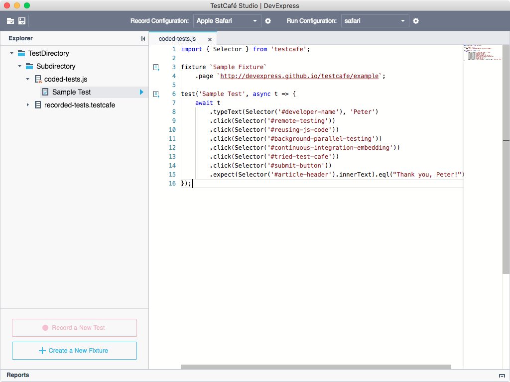

# Write Test Code

TestCafe Studio allows you to write tests using JavaScript and TypeScript. It provides a **Code Editor** with syntax highlight, code completion, parameter hints, etc.

Follow the steps below to write test code from scratch.

1. Create a `.js` or `.ts` file in a [test directory](organize-tests.md#test-directory) or subdirectory. Right-click the directory in the **Explorer** panel and select **New File** from the context menu. In the **New File** dialog, specify the file name and click **Create**. TestCafe Stuido creates the test file and opens it in the **Code Editor**.

2. Write the test code. See the [Test API](https://devexpress.github.io/testcafe/documentation/test-api/) topic in the open-source TestCafe documentation for information about the API used in tests.

    

## Convert Recorded Tests to JavaScript

You can convert recorded tests to JavaScript. See [Converting Fixtures to JavaScript](../user-interface/explorer-panel.md#converting-fixtures-to-javascript) for more information.