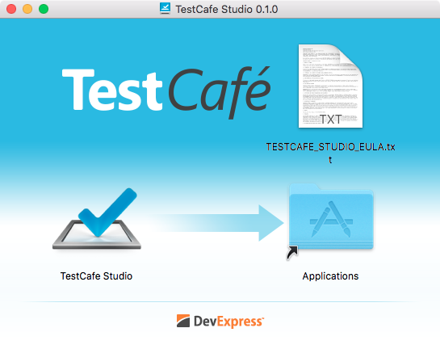
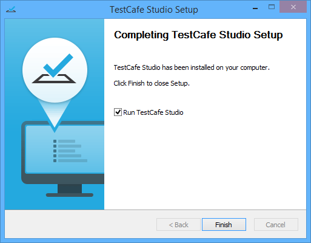
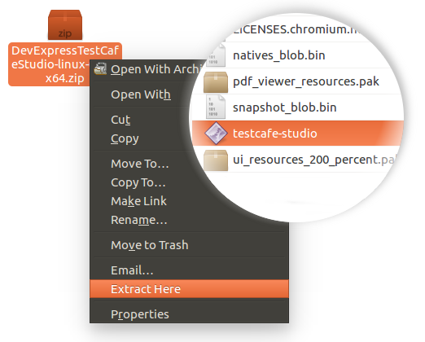

# Installing TestCafe Studio

Since TestCafe Studio can be used on different operating systems, it is distributed as an installation file for MacOS and Windows, and a separate ZIP file for Linux.

To install TestCafe Studio:

* **MacOS**. Download the MacOS installation file and double-click it to expand its contents. Drag the TestCafe Studio application to the **Applications** folder, making it available in the **Launchpad**.

    

* **Windows**. Download the Windows installation file and run it. The installation wizard will start and display the license agreement. If you accept the terms of the agreement, click **I Agree**. On the next page, specify if the software will be available to all users or just yourself and click **Install**. TestCafe Studio will be installed to *Program Files\DevExpress\TestCafe Studio*.

    

    After installation is completed, the instaler will create the TestCafe Studio shortcuts in the startup menu and on the desktop.

* **Linux**. Download the TestCafe Studio archive and unzip its contents to the directory where you wish to store TestCafe Studio program files. Note that this is not a temporary folder - no further installation or unpacking is required.

    To open TestCafe Studio, run the *testcafe-studio* file.

    

    If you need to relocate TestCafe Studio program files to a different directory, simply move them to the new location.
