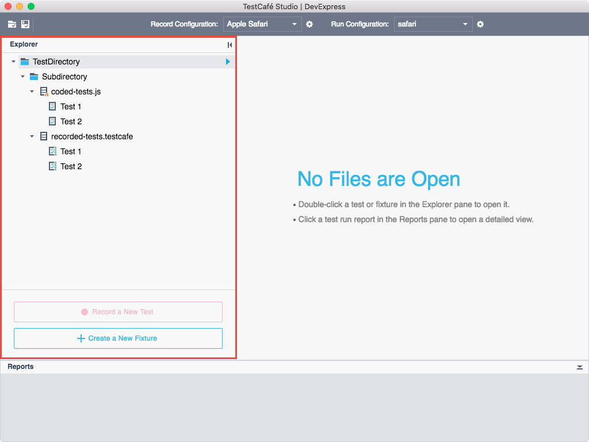
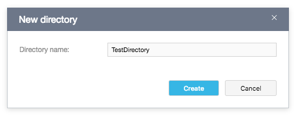
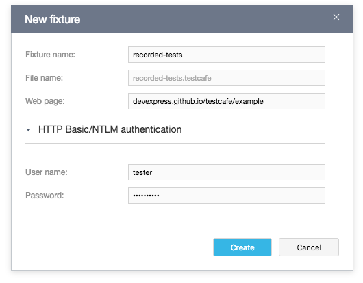
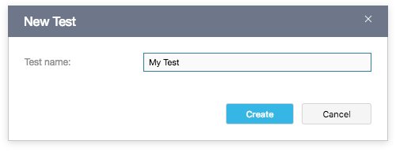
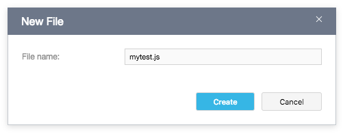
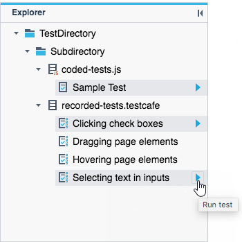
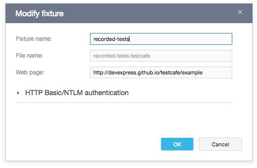
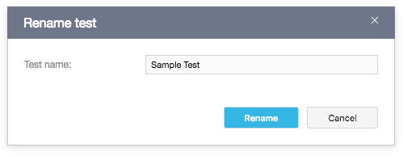
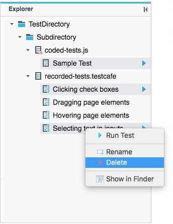

# Explorer Panel

The **Explorer** panel allows you to view and manage files in your [test directory](../guides/organize-tests.md#test-directory).

The panel shows the directory's content as a tree of subdirectories, files, and tests. See [Organize Tests](../guides/organize-tests.md) for more information.

You can manage test directories, files, fixtures, and tests using context menu commands. The available commands depend on the currently selected item in the panel.

The panel also has buttons for the frequently-used actions: **Record a New Test** and **Create a New Fixture**.

## Create a Directory

To create a new directory, invoke the context menu for a directory where you want to create it and select  **New Directory**. The **New Directory** dialog opens. Specify the directory name in this dialog and click **Create**.

The new directory appears in the **Explorer** panel.

## Create a Fixture

To create a new [fixture](../guides/record-tests/README.md#create-fixtures), select a directory where you want to create it and click the  **Create a New Fixture** button or select the  **New Fixture** command from the context menu. This invokes the **New Fixture** dialog.

Enter the fixture's name in the **Fixture name** dialog. A file name is automatically generated in the **File name** field. You can use the generated filename or specify your own.

In the **Web page** field, specify the tested webpage's URL. TestCafe Studio supports HTTP and HTTPS protocols. You can also use the `file://` scheme to tests web pages in the local file system.

If the tested webpage is protected with HTTP Basic or NTLM authentication, expand the **HTTP Basic/NTLM authentication** section and use the **User name** and **Password** fields to specify your credentials.

Finally, click the **Create** button. The new fixture appears in the **Explorer** panel.

## Create a Test

You can create a new test in one of the following ways:

* Record a test - Select the fixture where you want to create a test and click the  **Record a New Test** button. This automatically creates a new test, adds it to the fixture and starts [recording](../guides/record-tests/README.md).

* Create an empty test - Select the fixture where you want to create a test and select  **New Test** from the context menu. The **New Test** dialog appears.

    

    Specify the test name in this dialog and click **Create**. TestCafe Studio creates an empty test and opens it in the [Test Editor](test-editor.md).

## Create a File

To create a new file,  invoke the context menu in the directory where you want to create a file and select  **New File** from the context menu. The **New File** dialog appears. Specify the file name and extension in this dialog and click **Create**.

The created file appears in the **Explorer** panel and opens in the **Code Editor**.

## Run Tests

To run any runnable item (test, fixture or directory), hover the mouse over it and click the  **Run test** or **Run all tests** button appeared next to this item.

To run several tests from different fixtures and directories, select the tests using Shift-click, Ctrl-click, or Command-click, then click the  **Run Tests** button next to any selected item.

You can also use the context menu's  **Run Test** command to run tests.

## Modify a Fixture

To edit a fixture's properties, invoke the context menu and select  **Edit**. The **Modify Fixture** dialog appears. You can change the fixture name, file name, target webpage and authentication credentials in this dialog. To save the changes, click **OK**.

## Rename Tests

To rename a test, invoke the context menu for it and select  **Rename**. The **Rename Test** dialog appears. Specify the new test name and click **Rename**.

## Convert Fixtures to JavaScript

To convert a fixture with recorded tests to JavaScript, select the fixture in the **Explorer** panel, invoke the context menu for it and select  **Convert to JavaScript**. The **Convert to JavaScript** dialog appears. Specify the test file name and extension, then click **Create**.

TestCafe Studio creates the test file in the same test directory and displays it in the **Explorer** panel.

## View Test Code

To view JavaScript and TypeScript files in the **Code Editor**, select a fixture or test in the **Explorer** panel, then select  **Show Code** from the context menu. The fixture code opens in the **Code Editor**.

## Show Files in Windows Explorer/MacOS Finder

To view a fixture or directory in Windows Explorer and macOS Finder, invoke the context menu for the fixture or directory and select  **Show in Explorer/Finder**.

## Delete Directories, Fixtures and Tests

To delete a directory, fixture or test, invoke its context menu and select  **Delete**. A confirmation dialog appears. Click **Yes** to delete the selected item.

To delete several tests from different fixtures and directories, select the tests with Shift-click, Ctrl-click, or Command-click, then select  **Delete** from the context menu.

