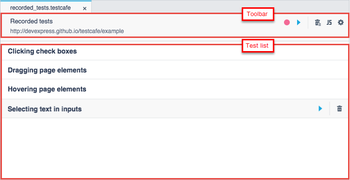

# Fixture Editor

The **Fixture Editor** allows you to view and modify a fixture. The editor opens when you double-click the fixture in the [Explorer](explorer-panel.md) panel.

The editor consists of the following parts:

* The toolbar - Provides information about the fixture (the name and tested webpage's URL) and buttons for performing [common tasks](#common-tasks).

    You can click the webpage's URL to open the webpage in the browser.

* The test list - Displays tests included to the fixture. You can click a test's row to open the test in the [Test Editor](test-editor.md).

## Common Tasks

You can perform the following tasks in the editor:

* [Record New Tests](#record-new-tests)
* [Run the Fixture or Single Test](#run-the-fixture-or-single-test)
* [Convert the Fixture to JavaScript](#convert-the-fixture-to-javascript)
* [Modify the Fixture's Properties](#modify-the-fixtures-properties)
* [Delete Tests](#delete-tests)

### Record New Tests

Click the  **Record a new test** button on the editor's toolbar to start recording a new test and add it to the fixture.

### Run the Fixture or Single Test

Click the  **Run all tests** button on the editor's toolbar to run the entire fixture.

To run a single test, hover the mouse cursor over the test's row and click the  **Run test** button displayed to the right of it.

### Convert the Fixture to JavaScript

Click the  **Convert to JavaScript** button on the editor's toolbar to convert the fixture to a .js file. The **Convert to JavaScript** dialog appears and allows you to specify the file's name.

TestCafe Studio creates the test file in the same test directory and displays it in the **Explorer** panel.

## Modify the Fixture's Properties

Click the  button on the editor's toolbar to modify the fixture's properties. This invokes the **Modify fixture** dialog where you can change the fixture name, file name, target webpage and authentication credentials. To save the changes, click **OK**.

### Delete Tests

Click the  **Remove all tests** button on the editor's toobar to delete all the fixture's tests.

To delete a single test from the fixture, hover the mouse cursor over the test's row and click the  **Remove test** button to the right of it.