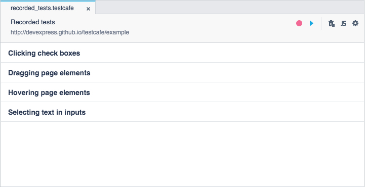

# Fixture View

The **Fixture** view displays information about a fixture: the fixture name, tested webpage's URL and list of included tests.

You can also perform the following tasks in this view:

* [Recording New Tests](#recording-new-tests)
* [Running the Fixture or Individual Tests](#running-the-fixture-or-individual-tests)
* [Deleting Tests](#deleting-tests)
* [Converting the Fixture to JavaScript](#converting-the-fixture-to-JavaScript)
* [Modifying the Fixture's Properties](#modfying-the-fixtures-properties)

To open the **Fixture** view, double-click the fixture in the [Explorer](explorer-panel.md) panel.

## Recording New Tests

You can start recording a new test and add it to the current fixture by clicking the  **Record test actions** button on the editor's toolbar.

## Running the Fixture or Individual Tests

To run an individual test, hover the mouse cursor over the test's row and click the  **Run test** button displayed to the right of it.

To run all the tests included to the current fixture, click the  **Run all tests** button on the editor's toolbar.

## Deleting Tests

To delete an individual test from the fixture, hover the mouse cursor over the test's row and click the  **Remove action** button to the right of it.

To delete all the tests, click the  **Remove all actions** button on the editor's toobar.

## Converting the Fixture to JavaScript

To convert the fixture to JavaScript, click the  **Convert to JavaScript** button on the editor's toolbar. This invokes the **Convert to JavaScript** dialog where you can specify the test file name and extension, then click **Create**.

TestCafe Studio creates the test file in the same test directory and displays it in the **Explorer** panel.

## Modifying the Fixture's Properties

To modify the fixture's properties, click the  button on the editor's toolbar. This invokes the **Modify fixture** dialog where you can change the fixture name, file name, target webpage and authentication credentials. To save the changes, click **OK**.

