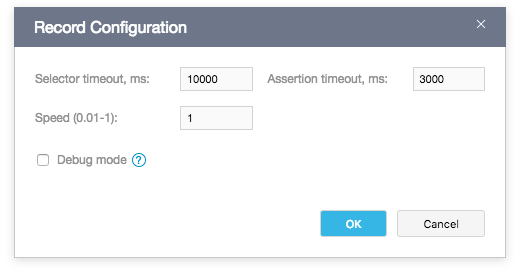

# Record Configuration Dialog

The **Record Configuration** dialog allows you to modify [record configuration](../working-with-testcafe-studio/recording-tests/README.md#record-configurations) options. These options affect the test playback during recording. When you click the  **Record test actions** button on the **Test Editor**'s toolbar to continue the  record, TestCafe Studio plays back the existing test actions using the specified options and waits for new actions.

To open the dialog, click the  button next to the **Record Configuration** drop-down menu on the main toolbar.

You can configure the following options:

Options           | Description
----------------- | -------------
*Selector timeout*  | Specifies the time (in milliseconds) element selectors can obtain the target DOM elements.
*Assertion timeout* | Specifies the time (in milliseconds) an assertion can take to pass before the test fails.
*Speed*             | Specifies the test speed from 0.01 to 1.
*Debug mode*        | Activates the [debug mode](../working-with-testcafe-studio/debugging-tests.md#debugging-recorded-tests).
