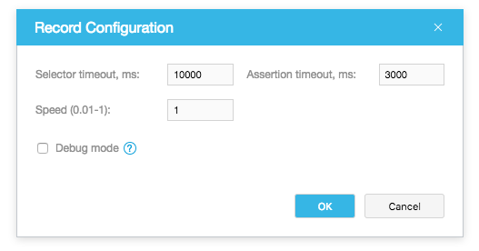

# Record Configuration Dialog

The **Record Configuration** dialog allows you to modify [record configuration](../working-with-testcafe-studio/recording-tests/README.md#record-configurations) options. These options affect the test playback during recording. That is when you continue recording a test by clicking the  **Record test actions** button on the **Test Editor**'s toolbar, TestCafe Studio plays back the existing test action using the specified options and waits for adding new actions.

To open dialog, click the  button next to the **Record Configuration** drop-down menu on the main toolbar.

You can configure the following options:

Options           | Description
----------------- | -------------
*Selector timeout*  | Specifies the time (in milliseconds) within which element selectors attempt to obtain target DOM elements.
*Assertion timeout* | Specifies the time (in milliseconds) an assertion can take to pass before the test fails.
*Speed*             | Specifies the test speed from 0.01 to 1.
*Debug mode*        | Activates the [debug mode](../working-with-testcafe-studio/debugging-tests.md#debugging-recorded-tests).