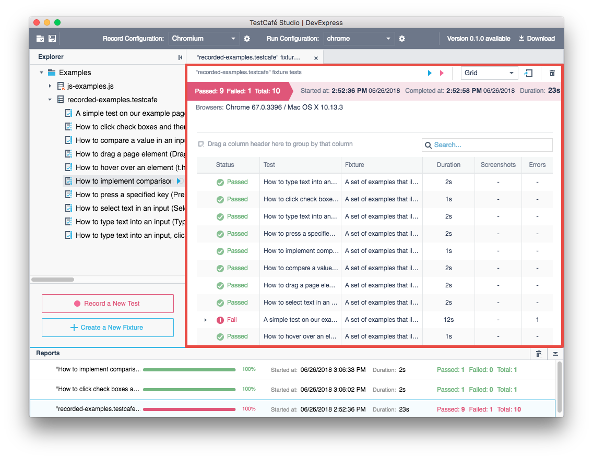
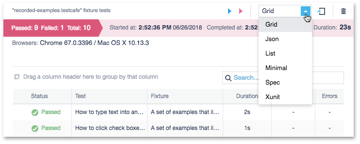
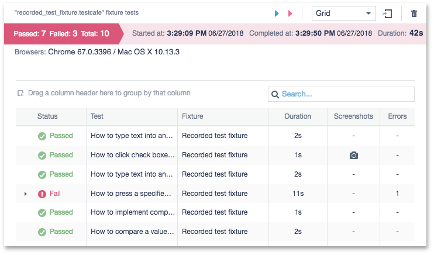
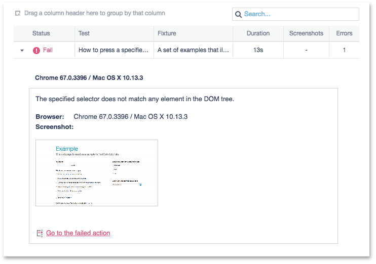
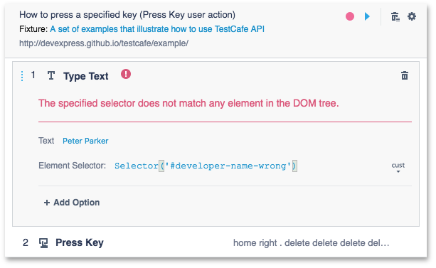
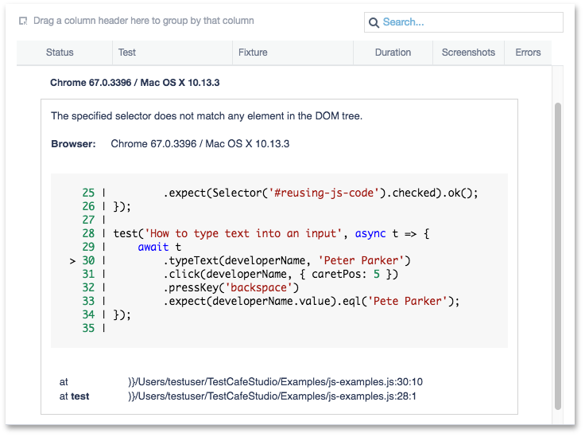
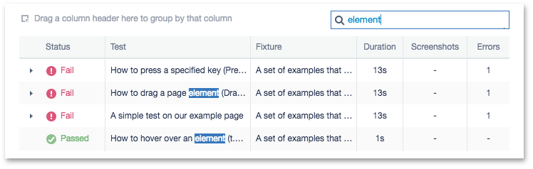
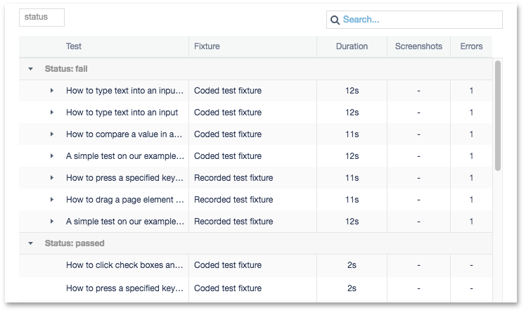
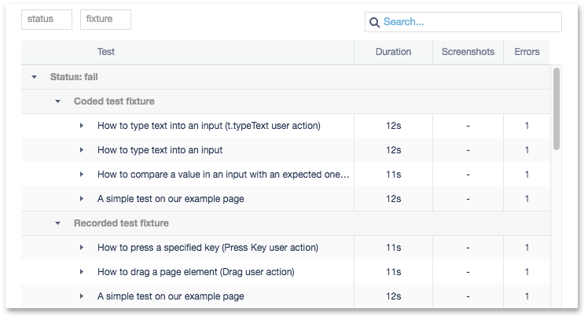

# Report View

The **Report** view displays a detailed report about a test run. It allows you to view the results in different formats, analyze them, restart failed tests, and export the report to a file.



* [Analyze Test Results](#analyze-test-results)
  * [Work with a Grid](#work-with-a-grid)
    * [Examine Failed Tests](#examine-failed-tests)
    * [Sort Data](#sort-data)
    * [Search for Tests](#search-for-tests)
    * [Group Data Records](#group-data-records)
* [Rerun Tests](#rerun-tests)
* [Export the Report](#export-the-report)
* [Remove the Report](#remove-the-report)
* [Get More Report Formats](#get-more-report-formats)

## Analyze Test Results

The **Report** view can present data in different formats. They include machine-readable formats like JSON or formats that better fit for human examination like a grid view. Use a drop-down list in the report header to select a format.



TestCafe Studio provides the following report formats out of the box:

* Grid view
* JSON
* xUnit
* List
* Minimal
* Spec

See [Get More Report Formats](#get-more-report-formats) to learn how to make more report formats available.

You can select the default format in [run configuration](run-configuration-dialog.md) settings.

### Work with a Grid

Grid view is the most powerful report format to study and analyze.



The top of the grid view displays general info about the test run:

* the total number of executed tests, the number of passed and failed tests,
* date and time when the test run was started and when it was completed,
* test run duration,
* names of browsers and operating systems used to run the tests.

The grid displays the following info about each test:

* test status (passed or failed),
* test name,
* fixture name,
* test run duration,
* the number of errors occurred during the test run.

You can click a test or fixture name to navigate to this test or fixture.

Click the  button in the **Screenshots** column to see screenshots taken with the [Take Screenshot](../working-with-testcafe-studio/recording-tests/test-actions/browser-actions.md#take-screenshot) action during the test run.


#### Examine Failed Tests

If a test has failed, an arrow is displayed near its status. This arrow allows you to expand the grid row and see details about this fail.



The detail view includes the following:

* the error message,
* the browser and operating system name,
* the page screenshot (if the [Take a screenshot if a test fails](run-configurations-dialog.md) option is enabled).

For [recorded tests](../working-with-testcafe-studio/organizing-tests.md#recorded-tests-files), the detail view displays a link to a test action that caused the fail. Click this link to navigate to the test file. The failed action will be automatically expanded and the error message will be displayed in it.



For [coded tests](../working-with-testcafe-studio/organizing-tests.md#coded-tests-files), the report shows a place in code where the fail occurred and the call stack.



#### Sort Data

Click the column header to sort tests by a column. To toggle sort order, click the header one more time.

#### Search for Tests

Use the search bar in the grid header to search for a test by its name or a fixture name.



You can also search for a failed test by the error message, callstack or call site.

#### Group Data Records

You can drag a column header and drop it onto the grid's header to group grid rows by that column.
The grid creates a row group for each value in the grouped column.



You can group by multiple columns. Drag several column headers to the grid header to create nested groups.



## Rerun Tests

You can rerun tests from the **Report** view. To rerun all tests in the test run, use the  **Restart all tests** button. If there are failed tests, you can use the  **Restart failed tests** button to rerun them separately.

## Export the Report

TestCafe Studio allows you to export a report to an archive file. This archive includes the serialized report in the selected format (JSON if the grid view is selected) and screenshots taken during the test run.

Use the  **Export report** button to export a report.

## Remove the Report

Click the  **Remove report** button in the grid view header to delete a test run report.

Note that this action cannot be undone.

## Get More Report Formats

You can install [TestCafe reporter plugins](https://devexpress.github.io/testcafe/documentation/using-testcafe/common-concepts/reporters.html) to add more report formats to TestCafe Studio.

Use the following console command to download and install plugins from [npm](https://www.npmjs.com/).

```sh
npm install -g <reporter-plugin-name>
```

Reporter plugins are npm packages. The reporter package name consists of two parts - the `testcafe-reporter-` prefix and the reporter's name itself; for example,  `testcafe-reporter-list`.

You can search for available reporter packages on npm: [https://www.npmjs.com/search?q=testcafe-reporter](https://www.npmjs.com/search?q=testcafe-reporter).

TestCafe Studio automatically detects reporter plugins installed on the local machine and adds them to the drop-down list in the **Report** view.