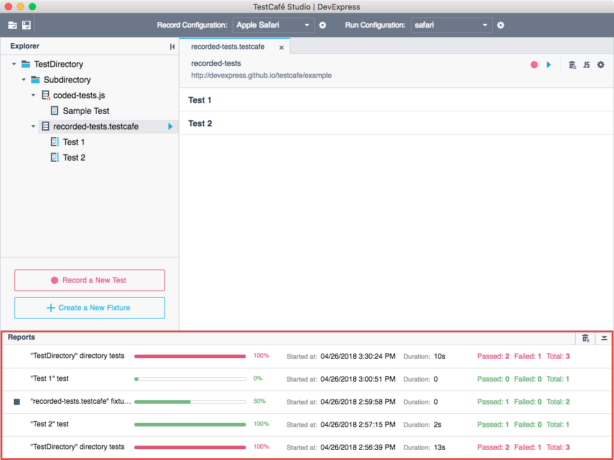

# Reports Panel

The **Reports** panel shows test run progress and results.

Each row in the **Reports** panel corresponds to a single test run. A test run can consist of an individual test, all tests from a particular directory or fixture, or an arbitrary group of tests. For more information, see [Running Tests](../working-with-testcafe-studio/running-tests.md).

A row in the **Reports** panel indicates:

* the test run name,
* a progress bar that shows test run progress,
* the test run start date and time,
* the test run duration,
* a counter that shows the total number of tests and the number of passed and failed tests.

The progress bar and counter color indicates test run outcome.

* green - all tests passed;
* red - some test failed;
* gray - undefined (for instance, a test run was interrupted).

## View a Detailed Report

Click a **Reports** panel row to view a complete test run report. This opens the **Report** view that presents details on the test run. To learn more, see [Report View](report-view.md).

## Stop Test Run

Use the  **Stop** button to stop a test run. This button is only displayed when a test run is in progress.

## Clear Results

Click the  **Clear reports** button in the panel header to remove all test run results from the **Reports** panel.

Note that this operation cannot be undone.

## Hide Reports Panel

Use the  **Collapse Panel** button to hide the **Reports** panel.

This hides the panel content but leaves the header visible. You can use the  **Expand Panel** button to bring the panel back later.