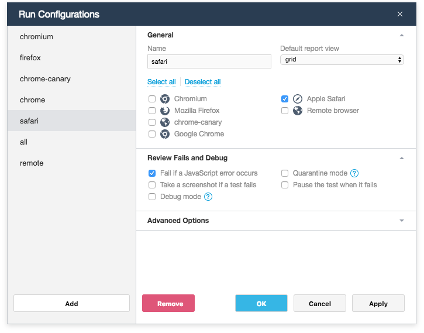

# Run Configurations Dialog

<!--A *run configuration* is a group of settings that define how tests should run. You can create many configurations and switch between them in TestCafe Studio.-->
The **Run Configurations** dialog allows you to create, modify and delete [run configurations](../working-with-testcafe-studio/running-tests.md#run-configurations).
The dialog opens when you click the  button next to the **Run Configuration** drop-down menu on the main toolbar.

The dialog's left panel displays the list of available run configurations. When you select a configuration in the list, the dialog's right section displays the configuration settings organized into several categories.

**General**

Setting | Description
------- | -------------
*Name* | The name of the test run configuration. It is displayed in the **Run Configurations** drop-down menu on the main toolbar.
*Default report view* | The format of the test run report used by default in **Reports View**.

**Browser**

This section lists locally installed browsers TestCafe Studio detects. Select those where tests should be run.
If you select multiple browsers, tests run in them simultaneously. You can use the **Select All** and **Deselect All** buttons to set or remove selection for all the browsers.

**Review Fails and Debug**

Setting                                         | Description
----------------------------------------------- | -----------
*Fail if a JavaScript error occurs on a page* | Specifies whether the test are considered failed if a JavaScript error occurs on the tested page. If unchecked, JavaScript errors are ignored.
*Take a screenshot if a test fails* | Specifies whether TestCafe take a screenshot of the tested page whenever a test fails.
*Debug mode* | Activates the [debug mode](../working-with-testcafe-studio/debugging-tests.md#debugging-recorded-tests).
*Quarantine mode* | Enables the *quarantine mode* for tests that fail. In this mode, a failed test is executed several times. The test result depends on the outcome (passed or failed) that occurs most often. That is, if the test fails on most attempts, the result is failed. If the test result differs between test runs, the test is marked as unstable.
*Pause the test when it fails* | Specifies whether to automatically activate the [debug mode](../working-with-testcafe-studio/debugging-tests.md#debugging-recorded-tests) when a test fails.

**Advanced Options**

Setting | Description
-------- | -------------
*Reports path* | The directory's path where test run reports are saved.
*Screenshots path* | The directory's path where screenshots captured during test execution are saved.
*Selector timeout* | Specifies the time (in milliseconds) within which an element selector attempts to obtain a target DOM element.
*Assertion timeout* | Specifies the time (in milliseconds) an [assertion](../working-with-testcafe-studio/recording-tests/test-actions/assetions.md) can take to pass before the test fails.
*Speed* | Specifies the [test speed](../working-with-testcafe-studio/debugging-tests.md#test-speed).
*Concurrency* | Specifies that tests should run concurrently.

## Managing Configurations

To create a new run configuration, click **Add**. TestCafe Studio adds a new configuration to the configuration list.

To edit a run configuration, select it in the dialog's left panel and modify its settings. Next, click **Apply** to apply the changes without leaving the dialog, or **OK** to apply the changes and close the dialog.

To remove a run configuration, use the **Remove** button.