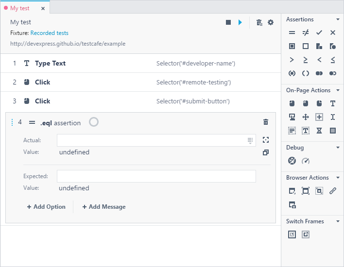

# Test Editor

The **Test Editor** allows you to create new tests and view and modify tests. To open the editor, double-click the test's item in the [Explorer](explorer-panel.md) panel or click the test's row in the [Fixture Editor](fixture-editor.md). If you [create an empty test](../working-with-testcafe-studio/recording-tests/README.md#creating-tests) or start [recording a new test](../working-with-testcafe-studio/recording-tests/README.md#starting-and-stopping-recording), TestCafe Studio automatically opens the test in the editor.

The **Test Editor** consists of the following parts:

* The toolbar - Provides information about the test (the test name, fixture name, tested page's URL) and buttons for performing [common tasks](#common-tasks).

    You can click the fixture name to open the fixture in the **Fixture Editor**. You can also click the webpage's URL to view the webpage in the browser.

* The test area - Displays the current test's content.
* The **Actions** panel - Lists [actions](../working-with-testcafe-studio/recording-tests/test-actions/README.md) you can add to the test.
    The actions are organized into categories. You can click the arrows next to the categories' names to expand or collapse the categories.

## Common Tasks

You can perform the following tasks in the editor:

* [Add Actions Manually](#add-actions-manually)
* [Record Actions](#record-actions)
* [Run Tests](#run-tests)
* [Modify Actions' Parameters](#modify-actions-parameters)
* [Change Actions' Position](#change-an-actions-position)
* [Rename Tests](#rename-tests)
* [Delete Actions](#delete-actions)

### Add Actions Manually

Click an action in the **Actions** panel to add it to the test. TestCafe Studio adds the action to the end of the test and allows you to specify the action's parameters.

You can add actions after or during recording. In the last case, you can pick an element on a webpage to set it as an action parameter (for example, [Element Selector](../working-with-testcafe-studio/recording-tests/test-actions/on-page-actions/action-parameters.md#element-selector) for [on-page actions](../working-with-testcafe-studio/recording-tests/test-actions/on-page-actions/README.md) or [Actual](../working-with-testcafe-studio/recording-tests/test-actions/assertions.md#actual-parameter) for [assertions](../working-with-testcafe-studio/recording-tests/test-actions/assertions.md)).

### Record Actions

You can record [on-page actions](../working-with-testcafe-studio/recording-tests/test-actions/on-page-actions/README.md) and append them to the current test.

Click the  **Record test actions** button on the toolbar to start recording and wait while TestCafe Studio plays back the existing actions. Next, perform new actions on the tested page. TestCafe Studio records your activity and inserts new actions after the previous actions.

To stop recording, close the browser or click the  button on the editor's toolbar.

### Run Tests

Click the  **Run test** button on the editor's toolbar to run the test.

### Modify Actions' Parameters

Click the action's row to expand the action parameters area that allows you to view or modify the action's parameters.

### Change an Action's Position

Hover the mouse cursor over the  button to the left of the action's name until the cursor icon changes to the  icon, then drag the action to a new position.

### Rename Tests

Click the  button on the editor's toolbar to rename the test. The **Rename test** dialog appears and allows you to specify a new test name.

### Delete Actions

Click the  **Remove all actions** button on the editor's toolbar to delete all the actions from the test.

To delete a single action, hover the mouse cursor over the action's row and click the row's  **Remove action** button.
