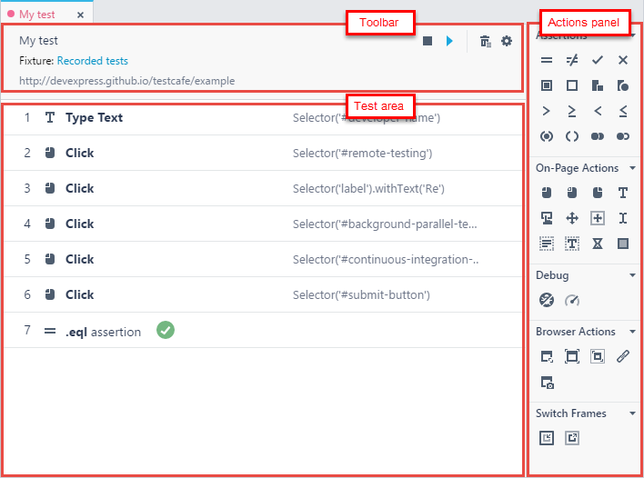

# Test Editor

The **Test** editor allows you to view and modify existing tests, and create new ones. To open a test in the editor, double-click it in the [Explorer](explorer-panel.md) panel or click it in the [Fixture](fixture-editor.md) editor. When you [create an empty test](../working-with-testcafe-studio/recording-tests/README.md#creating-tests) or start [recording a new test](../working-with-testcafe-studio/recording-tests/README.md#starting-and-stopping-recording), TestCafe Studio automatically opens the test in the editor.

The **Test** editor consists of the following parts:

* The test area - Displays the current test's content.
* The **Actions** panel - Lists [actions](../working-with-testcafe-studio/recording-tests/test-actions/README.md) you can add to the test.
    The actions are organized into categories. You can expand or collapse the categories by clicking the arrows next to the categories' names.
* The toolbar - Provides common information about the test (test name, fixture name, tested page's URL) and buttons for perfoming common tasks with it.

This topic desribes typical tasks you can perform in the editor:

* [Adding Actions to Tests](#adding-actions-to-tests)
* [Recording Actions into the Current Test](#recording-actions-into-the-current-test)
* [Modifying Actions' Parameters](#modifying-action-parameters)
* [Changing Actions' Position](#changing-action-position)
* [Deleting Actions](#deleting-actions)
* [Renaming Tests](#renaming-tests)
* [Running Tests](#running-tests)

## Adding Actions to Tests

To add a new action to the test, click it in the **Actions** panel. The action is added to the end of the test. Then specify the action parameters.

You can add actions after or during recording. In the last case, you can set some action parameters, like [Element Selector](../working-with-testcafe-studio/recording-tests/test-actions/on-page-actions/action-parameters.md#element-selector) or [Actual](../working-with-testcafe-studio/recording-tests/test-actions/assertions.md#actual-parameter), by picking an element on a webpage.

## Recording Actions into the Current Test

You can record [on-page actions](../working-with-testcafe-studio/recording-tests/test-actions/on-page-actions/README.md) and add them to the current test. To do this, click the  **Record test actions** button on the toolbar to start recording and perform desired actions on the tested page. TestCafe Studio records your activity and inserts new actions after the existing ones.

## Modifying Actions' Parameters

You can view and modify an action's parameters in the action parameters area. To view this area, click the  button to the left of the action's name.

## Changing Actions' Position

To change an action's position, hover the mouse cursor over the  button to the left of the action's name until the cursor icon changes to the  icon, then click and drag the action to a new position.

## Deleting Actions

To delete an action from the test, hover the mouse cursor over it and click the  **Remove action** button to the right of the action's row.

To delete all actions, click the  **Remove all actions** button on the editor's toobar.

## Renaming Tests

To rename the test, click the  button on the editor's toolbar. This invokes the **Rename test** dialog when you can specify a new test name.

## Running Tests

To run the test, click the  **Run test** button on the editor's toolbar.