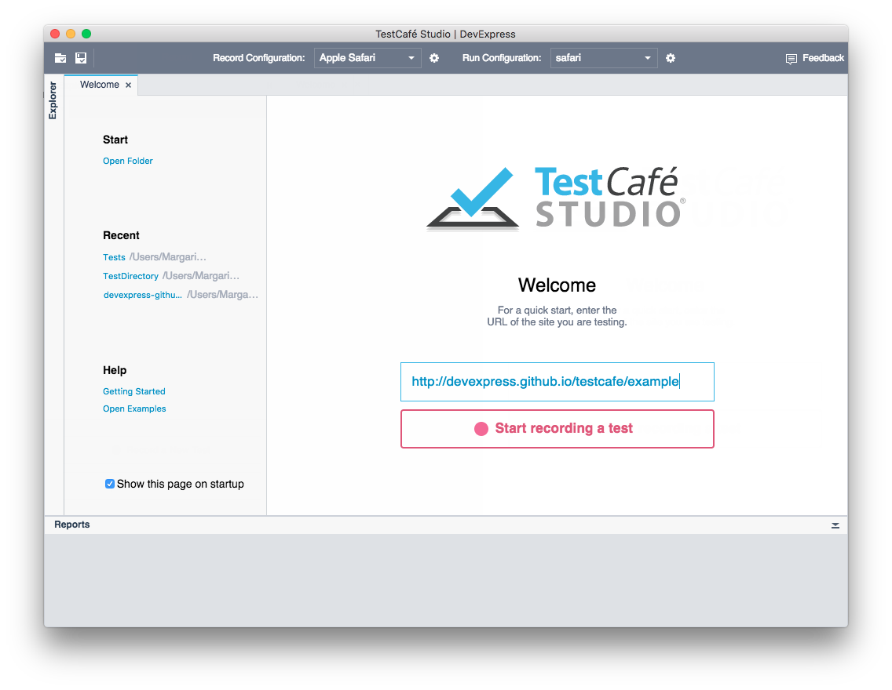

# Welcome Page

The **Welcome** page introduces you to TestCafe Studio. The page is shown every time when you open the tool. To enable or disable showing the page, use the **Show this page on startup** checkbox. To open the **Welcome** page manually, go to the **Help** menu and select **Welcome**.

The page allows you to perform the following tasks:

* [Start Recording a Test](#start-recording-a-test)
* [Open Test Directories](#open-test-directories)
* [Open Recent Test Directories](#open-recent-test-directories)
* [Navigate to Documentation and Video Tutorials](#navigate-to-documentation-and-video-tutorials)

## Start Recording a Test

Enter a tested site's URL to the page's input field and click the  **Start recording a test** button to start the recording. TestCafe Studio creates a test, launches a browser with the tested site and starts recording your activity on the webpage. TestCafe Studio adds your actions to the test. You can view the test in the [Test Editor](test-editor.md).

To stop the recording, close the browser.

## Open Test Directories

The page's **Start** section contains buttons that allow you to:

* create a new [test directory](../guides/organize-tests.md#test-directory).
* open an existing test directory.
* open the directory with example tests: [recorded](../guides/organize-tests.md#recorded-test-files) and [coded](../guides/organize-tests.md#coded-test-files).

After you open a test directory in TestCafe Studio, you can view the directory's content in the [Explorer](explorer-panel.md) panel.

## Open Recent Test Directories

The page's **Recent** section lists recently opened test directories. Click a desired directory in the list to open it in TestCafe Studio. You can view the directory's content in the [Explorer](explorer-panel.md) panel.

## Navigate to Documentation and Video Tutorials

The page also provides links to the documentation and [video tutorials](../video-tutorials/README.md).