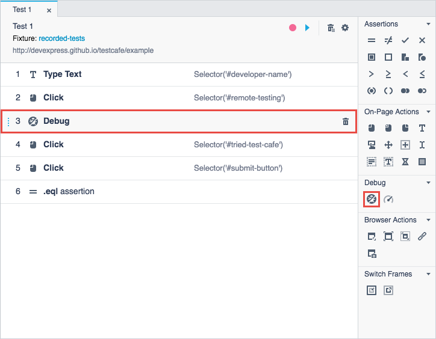
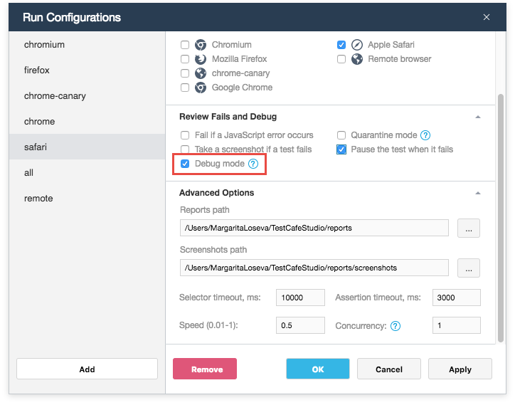
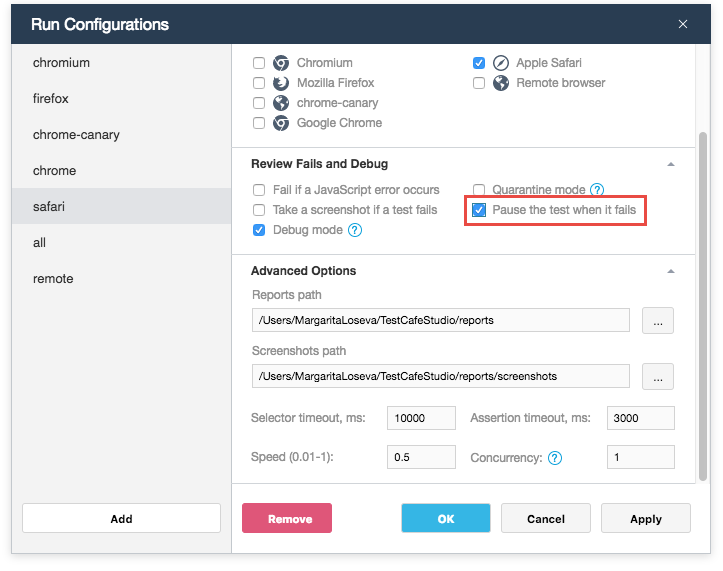
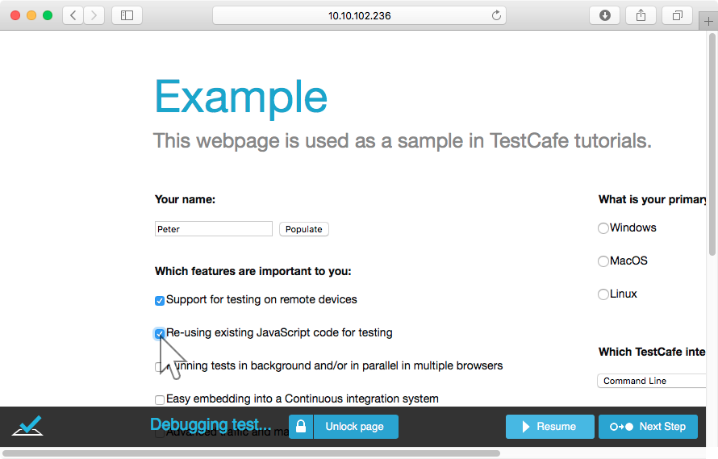
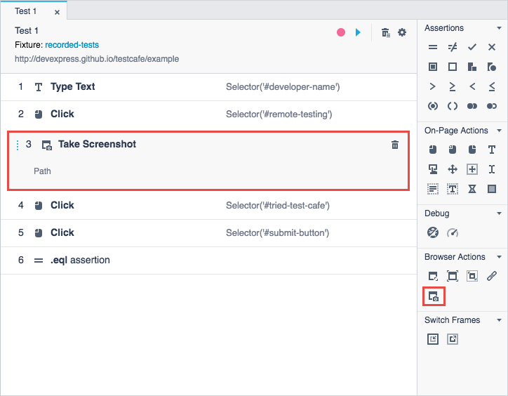
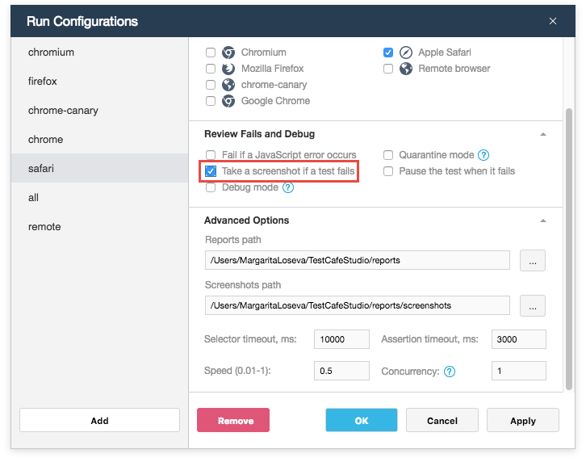
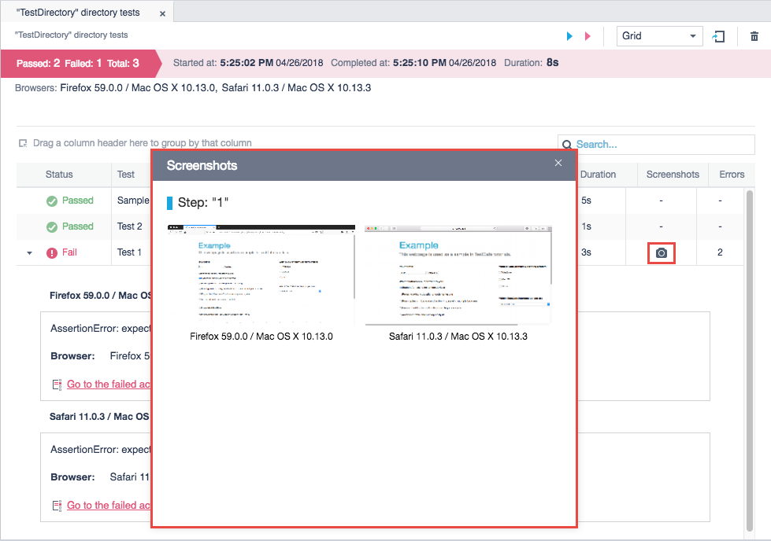
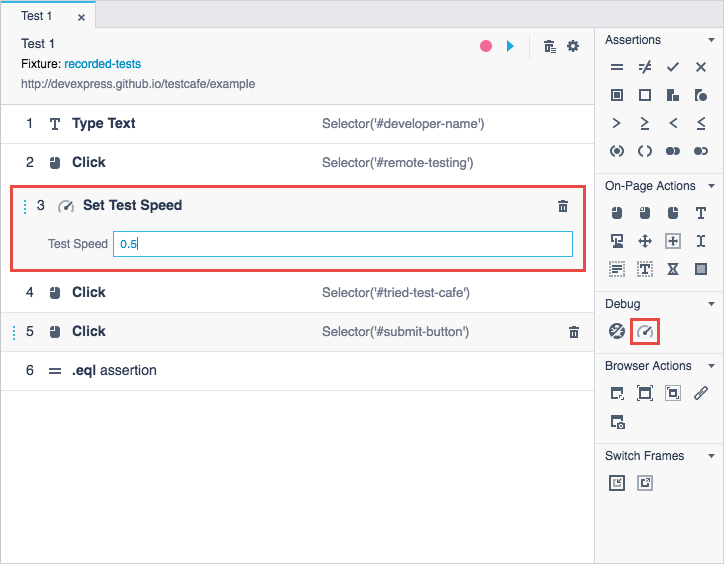
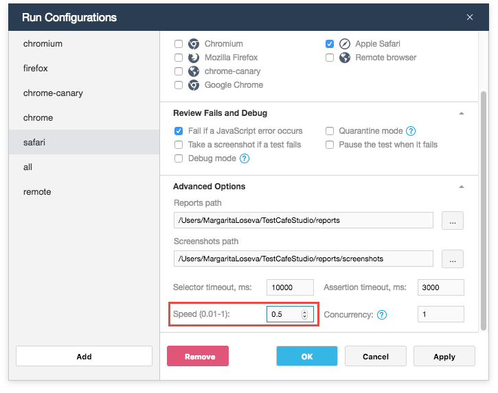

# Debugging Tests

This topic provides information about debugging tests and consists of the following sections:

* [Debugging Recorded Tests](#debugging-recorded-tests)
  * [Features Useful for Debugging](#features-useful-for-debugging)
* [Debugging Coded Tests](#debugging-coded-tests)

## Debugging Recorded Tests

TestCafe Studio's *debug mode* helps you understand what is happening in your web page during testing. In this mode, TestCafe Studio pauses the test and allows you to debug the tested page using the browser's developer tools. You can check the web page state, DOM elements' location, their CSS styles, etc.

You can activate the debug mode in one of the following ways:

* Add the [Debug](recording-tests/test-actions/debug.md#debug) action to a particular place in a test. When test execution reaches this action, it pauses.

    

* Enable the **Debug mode** option for a run configuration in the **Run Configurations** dialog. In this case, the test is paused before the first test action.

    

* Enable the **Pause the test when it fails** option for a run configuration in the **Run Configurations** dialog. TestCafe Studio automatically enters the debug mode when the test fails.

    

Once the test is paused, you can open browser's developer tools and debug.

During debugging, the browser window displays a footer with the following buttons:

* The **Unlock Page** button unlocks the tested page and allows you to interact with its elements.
* The **Resume** button resumes the test.
* The **Next Action** button allows you to skip to the next test action.

### Features Useful for Debugging

TestCafe Studio includes features that help you find the cause of issues in your tests.

#### Screenshots

TestCafe Studio can capture screenshots of a browser window during test runs. You can analyze these screenshots to determine the cause of issues.

There are two ways to take screenshots:

* Use the [Take Screenshot](recording-tests/test-actions/browser-actions.md#take-screenshot) action to take a screenshot in a particular place in a test.

    

* Turn on the *Take a screenshot if a test fails* option for a desired run configuration in the **Run Configurations** dialog. This option enables TestCafe Studio to take a screenshot when a test fails.

    

TestCafe Studio stores the screenshots in a directory specified in the **Run Configurations** dialog and displays them in test reports.

#### Test Speed

Tests are executed at full speed with minimum delays between actions by default. This makes it hard to identify problems visually when running a test.

TestCafe Studio allows you to change test speed in one of the following ways:

* Use the **Set Test Speed** action. The action parameter allows you to specify the test speed from 1 to 0.01.

    

* Change the **Speed** option's value in the **Advanced Options** section of the **Run Configurations** dialog.

    

## Debugging Coded Tests

See [Debugging](https://devexpress.github.io/testcafe/documentation/test-api/debugging.html) in TestCafe documentation for more information about debugging coded tests.