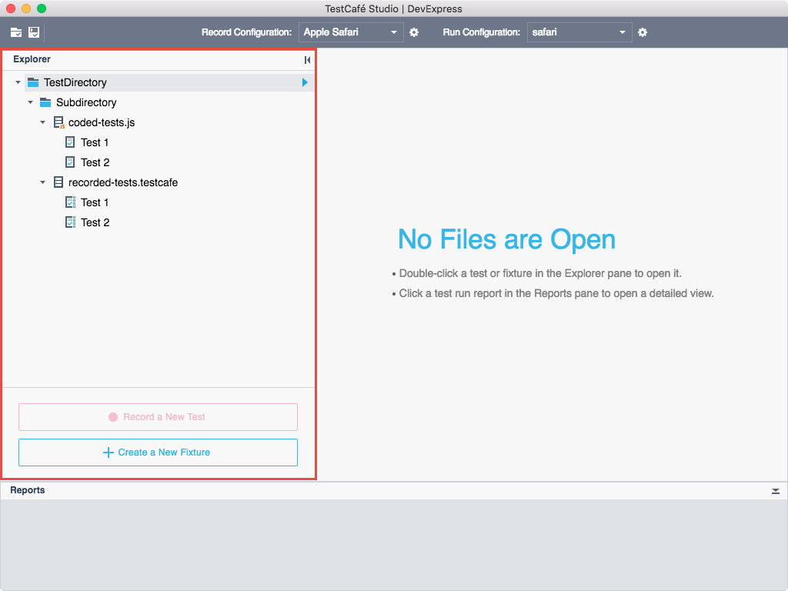

# Organizing Tests

This topic provides information on how to organize your test files.

* [Test Directory](#test-directory)
* [Recorded Tests Files](#recorded-tests-files)
* [Coded Tests Files](#coded-tests-files)

The image below demonstrates the **Explorer** panel that allows you to manage your test files.

## Test Directory

A test directory is a file system directory used as the root of your test-related workspace. It is used to store [files](#test-files) with recorded and coded tests.

You can create a test directory anywhere on your computer and then open it in TestCafe Studio in one of the following ways:

* Go to the **File** menu and click **Open Test Directory**.
* On the **Welcome** page, click **Open Folder**.

The **Explorer** panel displays the directory's content.

> TestCafe Studio automatically creates a test directory in the *Users/Username/TestCafeStudio* folder and gives it the tested site's name if you start recording a test from the **Welcome** page. If a directory with the same name already exists, TestCafe Studio opens it and adds a new test to it.

You can also organize test files into *subdirectories*. To create a subdirectory, right-click a test directory in the **Explorer** panel and select **New Directory**. In the **New directory** dialog, enter the directory name and click the **Create** button.

## Recorded Tests Files

**Recorded tests** are tests you record visually or compose from test actions. These tests are stored in `*.testcafe` files. TestCafe Studio automatically creates a new `*.testcafe` file when you [start recording a test](recording-tests.md#starting-and-stopping-recording) for a new tested page.

The `.testcafe` test file can contain one more recorded tests.

See [Recording Tests](recording-tests.md) for information on how to record tests.

## Coded Tests Files

TestCafe Studio also allows you to write tests in JavaScript or TypeScript. Create a `.js` or `.ts` file in a test directory, open this file in a built-in code editor and write test code. Refer to [Writing Test Code] for more details.

> TestCafe Studio also allows you to use tests created in an earlier TestCafe version (`.test.js` files). You can add these files to a test directory and view/modify/run the tests from TestCafe Studio.
