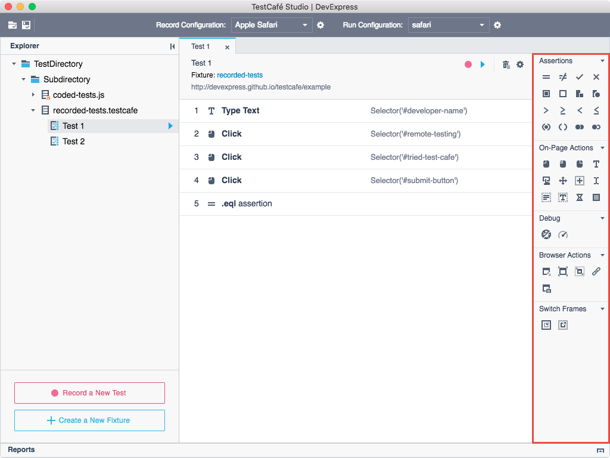
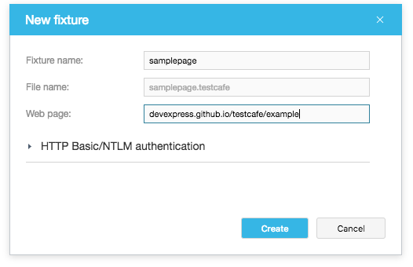

# Recording Tests

Tests consist of **test actions** to be performed with a tested page.

TestCafe Studio provides a set of actions that you can use in tests. These actions are organized into different categories in the **Test Editor**'s **Actions** panel. For example, **On-Page Actions** simulate user actions- clicks, key presses, drags, etc. on your tested page. The actions in the **Assertions** category allow you to perform different verifications.

Actions have parameters that enable you to specify a target element and define how the action should be performed.

You can create tests:

* by recording test actions;
* by adding test actions to a test manually in the **Test Editor**.

The following sections provide detailed information about recording tests:

* [Record Configurations](#record-configurations)
* [Creating Fixtures](#creating-fixtures)
* [Creating Tests](#creating-tests)
* [Starting and Stopping Recording](#starting-and-stopping-recording)
* [During Recording](#during-recording)
* [Modifying Tests](#modifying-tests)

## Record Configurations

You can record a test in any local browser. TestCafe detects browsers on the local computer and adds them to the **Record configuration** list. Before recording a test, select the record configuration from the list.

You can modify record configuration options by clicking the  button and using the **Record Configuration** dialog.

## Creating Fixtures

Recorded tests must be organized into categories called **fixtures**. A fixture contains tests for a single target URL, and you usually have one fixture per website page.

Follow the steps below to create a fixture:

1. Open a [test directory](organizing-tests.md#test-directory).
2. Do any of the following:
    * In the **Explorer** panel, click **Create a New Fixture** button.
    * Right-click a test directory or subdirectory in the **Explorer** panel and select **New Fixture** from the context menu.
    This opens the **New Fixture** dialog.
3. Specify the fixture name and the tested page’s URL.

    

4. Click **Create**.

TestCafe Studio creates the fixture and opens it in the **Fixture Editor**.

After the fixture is created, you can start recording tests.

> If you start recording a test from the **Welcome** page, TestCafe Studio automatically creates a new fixture.

## Creating Tests

> You can create a test manually or you can skip this step and go to recording. When you start recording, TestCafe Studio will automatically create a new test. See [Starting and Stopping Recording](#starting-and-stopping-recording).

To create an empty test:

1. Open the context menu for a desired fixture in the **Explorer** panel and select **New Test**.
2. In the **Create Test** dialog, specify the test name and click **Create**.

TestCafe Studio creates a test with the specified name and opens it in the **Test Editor**. Next, add actions to the test from the **Actions** panel manually or record them. To start recording, click the  **Record test actions** button on the **Test Editor** toolbar.

## Starting and Stopping Recording

Do any of the following **to start recording** a new test:

* Select a fixture in the **Explorer** panel and click the  **Record a New Test** button.
* Click the  **Record a new test**  button on the **Fixture Editor** toolbar.
* Click the  **Start recording a test** button on the **Welcome** page.

TestCafe Studio creates a new test, adds it to the fixture and starts recording test actions. See [During Recording](#during-recording).

**To stop recording**, close the browser or click the  button on the **Test Editor** toolbar.

**To continue recording**, click the  **Record test actions** button on the **Test Editor** toolbar. TestCafe replays the previous actions and waits for new ones.

## During Recording

When TestCafe Studio starts recording, it launches the browser specified in the **Record configuration** list and starts recording your activity on the tested page.

You can do the following during test recording:

* Record on-page actions (clicks, drags, key presses, etc.) by interacting with the web page. TestCafe Studio adds these actions with their necessary parameters to the test.

* Add actions from the **Actions** panel to the test. To do this, click a desired action in the **Actions** panel. The action is added to the end of the test. Then specify the action parameters.

    When you add an on-page action or assertion, you can visually select a target element on the tested page. To do this, click the  button in the action parameters' area and click an element on the page.

    You can also choose a desired property from the auto-generated property list and see the assertion status for assertion.

* View and modify the recorded actions. See [Modifying Tests](#modifying-tests).

### Modifying Tests

You can view and modify recorded tests in the **Test Editor** both during and after recording by performing the following tasks:

* Rename tests.

* Re-order and delete actions.

* View and modify action parameters.

* Add new actions.

See the **Test Editor** panel's description for more information.

> You cannot visually select a target elements for actions if you add or modify actions after recording, you need to specify them manually.
