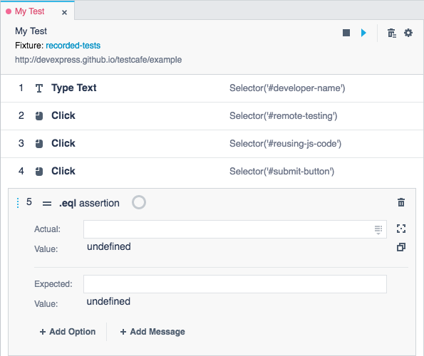
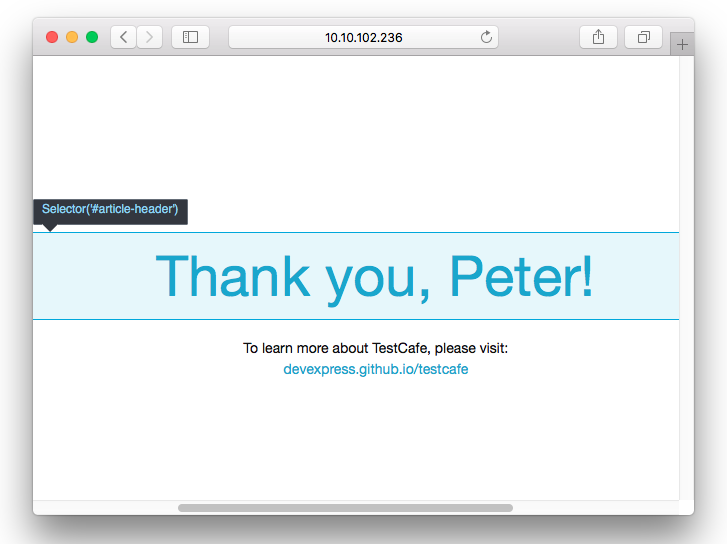
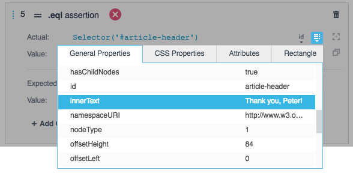
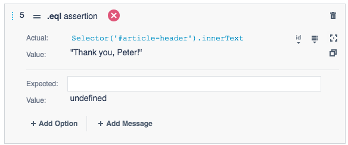

# Assertions

The **Assertions** category contains verification actions.

*  [Equals](#equals)
*  [Not Equals](#not-equals)
*  [Ok](#ok)
*  [Not Ok](#not-ok)
*  [Contains](#contains)
*  [Not Contains](#not-contains)
*  [Type of](#type-of)
*  [Not Type of](#not-type-of)
*  [Greater than](#greater-than)
*  [Greater than or Equals to](#greater-than-or-equals-to)
*  [Less than](#less-than)
*  [Less than or Equals to](#less-than-or-equals-to)
*  [Within](#within)
*  [Not Within](#not-within)
*  [Match](#match)
*  [Not Match](#not-match)

## Assertion Parameters

You have to set up an assertion's parameters when you add it to a test.

### Actual Parameter

Each assertion has an *Actual* parameter that takes a value or evaluated code expression that should be verified. If you need to verify a web page element's property, you can pass a [selector](https://devexpress.github.io/testcafe/documentation/test-api/selecting-page-elements/selectors/)'s property to this parameter.

When you add an assertion during recording, TestCafe Studio can generate an element property expression and use it in the **Actual** field. Follow the steps below to generate the expression:

1. Add an assertion action to a test.

    

2. Click the  button next to the **Actual** field and pick a target element on the tested webpage using an element picker.

     

3. TestCafe shows the property list for the picked element. Double-click a property in the list.

    

4. TestCafe Studio generates the element property expression and adds it to the **Actual** field. It also evaluates the specified expression and shows the result in the **Value** field.

    

### Expected Parameter

Some assertions have the *Expected* parameter that takes an expected value or code expression. You can enter a value manually or copy the value to the **Expected** field by clicking the  button.

When you specify the assertion parameters during recording, TestCafe Studio shows the assertion status icon ( - the assertion passed,  - the assertion failed).

## Assertion Options

You can add the following options to assertions:

* *Timeout* - the time (in milliseconds) an assertion can take to pass before the test fails. To add this option, click the **Add Timeout** button in the assertion parameters area.

* *Message* - an assertion message that is displayed in the report if the test fails. To add this option, click the **Add Message** button in the assertion parameters area.

## Equals

Asserts that *Actual* is equal to *Expected*.

Parameter              | Type                                              | Description
---------------------- | ------------------------------------------------- | ------------------------------------------------------------------------------------------------------------------
*[Actual](#actual-parameter)*             | Any type &#124; Selector's property | The value to verify.
*[Expected](#expected-parameter)*             | Any type | The expected value.

## Not Equals

Asserts that *Actual* is not equal to *Expected*.

Parameter              | Type                                              | Description
---------------------- | ------------------------------------------------- | ------------------------------------------------------------------------------------------------------------------
*[Actual](#actual-parameter)*             | Any type &#124; Selector's property | The value to verify.
*[Expected](#expected-parameter)*             | Any type | The expected value.

## Ok

Asserts that *Actual* is true.

Parameter              | Type                                              | Description
---------------------- | ------------------------------------------------- | ------------------------------------------------------------------------------------------------------------------
*[Actual](#actual-parameter)*             | Any type &#124; Selector's property | Value should be true.

## Not Ok

Asserts that *Actual* is false.

Parameter              | Type                                              | Description
---------------------- | ------------------------------------------------- | ------------------------------------------------------------------------------------------------------------------
*[Actual](#actual-parameter)*             | Any type &#124; Selector's property | Value should be false.

## Contains

Asserts that *Actual* contains *Expected*.

Parameter              | Type                                              | Description
---------------------- | ------------------------------------------------- | ------------------------------------------------------------------------------------------------------------------
*[Actual](#actual-parameter)*             | String &#124; Array &#124; Object &#124; Selector's property | The string that contains the *Expected* substring, an array that contains the *Expected* value or an object that contains the *Expected* property.
*[Expected](#expected-parameter)*            | Any type | The expected value.

## Not Contains

Asserts that *Actual* does not contain *Expected*.

Parameter              | Type                                              | Description
---------------------- | ------------------------------------------------- | ------------------------------------------------------------------------------------------------------------------
*[Actual](#actual-parameter)*             | String &#124; Array &#124; Object &#124; Selector's property | The string that should not contain the *Expected* substring, the array that should not contain the *Expected* value or the object that should not contain the *Expected* property.
*[Expected](#expected-parameter)*             | Any type | The expected value.

## Type of

Asserts that the *Actual* belongs to a particular type.

Parameter              | Type                                              | Description
---------------------- | ------------------------------------------------- | ------------------------------------------------------------------------------------------------------------------
*[Actual](#actual-parameter)*             | Any type &#124; Selector's property  | The value to verify.
*Type Name*             | String | The *Actual* value should be this type.

## Not Type of

Asserts that the *Actual* does not belong to a particular type.

Parameter              | Type                                              | Description
---------------------- | ------------------------------------------------- | ------------------------------------------------------------------------------------------------------------------
*[Actual](#actual-parameter)* | Any type &#124; Selector's property | The value to verify.
*Type Name*             | String | The *Actual* value should not be this type.

## Greater than

Asserts that *Actual* is greater than *Expected*.

Parameter              | Type                                              | Description
---------------------- | ------------------------------------------------- | ------------------------------------------------------------------------------------------------------------------
*[Actual](#actual-parameter)* | Number &#124; Selector's property | Value should be greater than *Expected*.
*[Expected](#expected-parameter)*            | Any type | The expected value.

## Greater than or Equals to

Asserts that *Actual* is greater than or equal to *Expected*.

Parameter              | Type                                              | Description
---------------------- | ------------------------------------------------- | ------------------------------------------------------------------------------------------------------------------
*[Actual](#actual-parameter)* | Number &#124; Selector's property | Value should be greater than or equal to *Expected*.
*[Expected](#expected-parameter)*             | Any type | The expected value.

## Less than

Asserts that *Actual* is less than *Expected*.

Parameter              | Type                                              | Description
---------------------- | ------------------------------------------------- | ------------------------------------------------------------------------------------------------------------------
*[Actual](#actual-parameter)* | Number &#124; Selector's property | Value should be less than *Expected*.
*[Expected](#expected-parameter)*             | Any type | The expected value.

## Less than or Equals to

Asserts that *Actual* is less than or equal to *Expected*.

Parameter              | Type                                              | Description
---------------------- | ------------------------------------------------- | ------------------------------------------------------------------------------------------------------------------
*[Actual](#actual-parameter)* | Number &#124; Selector's property | Value should be less than or equal to *Expected*.
*[Expected](#expected-parameter)*             | Any type | The expected value.

## Within

Asserts that *Actual* is within a range from *Start Value* to *Finish Value*. Bounds are inclusive.

Parameter              | Type                                              | Description
---------------------- | ------------------------------------------------- | ------------------------------------------------------------------------------------------------------------------
*[Actual](#actual-parameter)* | Number &#124; Selector's property | The value to verify.
*Start Value*             | Number | The range's lower bound (included).
*Finish Value*            | Number | The range's upper bound (included).

## Not Within

Asserts that *Actual* is not within a range from *Start Value* to *Finish Value*. Bounds are inclusive.

Parameter              | Type                                              | Description
---------------------- | ------------------------------------------------- | ------------------------------------------------------------------------------------------------------------------
*[Actual](#actual-parameter)* | Number &#124; Selector's property | The value to verify.
*Start Value*             | Number | The range's lower bound (included).
*Finish Value*            | Number | The range's upper bound (included).

## Match

Asserts that *Actual* matches the *re* regular expression.

Parameter              | Type                                              | Description
---------------------- | ------------------------------------------------- | ------------------------------------------------------------------------------------------------------------------
*[Actual](#actual-parameter)* | String &#124; Selector's property | The value to verify.
*re*             | RegExp | The regular expression that should match *Actual*.

## Not Match

Asserts that *Actual* does not match the *re* regular expression.

Parameter              | Type                                              | Description
---------------------- | ------------------------------------------------- | ------------------------------------------------------------------------------------------------------------------
*[Actual](#actual-parameter)* | String &#124; Selector's property | The value to verify.
*re*             | RegExp | The regular expression that should not match *Actual*.
