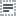

# On-Page Actions

The **On-Page Actions** category contains test actions that simulate user actions on a tested web page.

*  [Click](#click)
*  [Double Click](#double-click)
*  [Right Click](#right-click)
*  [Type Text](#type-text)
*  [Press Key](#press-key)
*  [Drag](#drag)
*  [Drag To Element](#drag-to-element)
*  [Select Text](#select-text)
*  [Select Editable Content](#select-editable-content)
*  [Select Text Area Content](#select-text-area-content)
*  [Pause](#pause)
*  [Hover](#hover)

You can record the major of these actions by interacting with a tested web page. TestCafe Studio adds these actions with their necessary parameters to the test.

You can also add them to a test manually.

## Click

Clicks a webpage element with the left mouse button.

Parameter | Type  | Description
--------- | ----- | -------------
*Element Selector* | Selector | Identifies the webpage element being clicked. See [Selecting Target Element](README.md#selecting-target-elements).

## Double Click

Double-clicks a webpage element with the left mouse button.

Parameter | Type  | Description
--------- | ----- | -------------
*Element Selector* | Selector | Identifies the webpage element being double-clicked. See [Selecting Target Element](README.md#selecting-target-elements).

## Right Click

Clicks a webpage element with the right mouse button.

Parameter | Type  | Description
--------- | ----- | -------------
*Element Selector* | Selector | Identifies the webpage element being right-clicked. See [Selecting Target Element](README.md#selecting-target-elements).

## Type Text

Types text within an input element.

Parameter | Type  | Description
--------- | ----- | -------------
*Element Selector* | Selector | Identifies the webpage element that will receive input focus. See [Selecting Target Element](README.md#selecting-target-elements).
*Text* | String | The text to be typed into the specified webpage element.

## Press Key

Presses the specified keyboard key.

Parameter | Type | Description
--------- | ----- | -------------
*Key* | String | The sequence of keys and key combinations to be pressed.

## Drag

Drags a webpage element to the specified location.

Parameter | Type  | Description
--------- | ----- | -------------
*Element Selector* | Selector | Identifies the webpage element being dragged. See [Selecting Target Element](README.md#selecting-target-elements).
*DragOffsetX* | Number | An X-offset of the drop coordinates from the mouse pointer's initial position.
*DragOffsetY* | Number | An Y-offset of the drop coordinates from the mouse pointer's initial position.

## Drag To Element

Drags a webpage element to another element.

Parameter | Type  | Description
--------- | ----- | -------------
*Element Selector* | Selector | Identifies the webpage element being dragged. See [Selecting Target Element](README.md#selecting-target-elements).
*Destination Selector* | Selector | Identifies the webpage element that serves as the drop location. See [Selecting Target Element](README.md#selecting-target-elements).

## Select Text

Selects text within an input element.

Parameter | Type  | Description
--------- | ----- | -------------
*Element Selector* | Selector | Identifies the webpage element whose text will be selected. See [Selecting Target Element](README.md#selecting-target-elements).
*Start Position* | Number | The start position of the selection. A zero-based integer.
*End Position* | Number | The end position of the selection. A zero-based integer.

## Select Editable Content

Selects text within a contenteditable element.

Parameter | Type  | Description
--------- | ----- | -------------
*Start Selector* | Selector | Identifies the webpage element from which selection starts. The start position of selection is the first character of the element's text. See [Selecting Target Element](README.md#selecting-target-elements).
*End Selector* | Selector | Identifies the webpage element at which selection ends. The end position of selection is the last character of the element's text. See [Selecting Target Element](README.md#selecting-target-elements).

## Select Text Area Content

Selects text within a text area element.

Parameter | Type  | Description
--------- | ----- | -------------
*Start Selector* | Selector | Identifies the text area whose text will be selected. See [Selecting Target Element](README.md#selecting-target-elements).
*Start Line* | Number | The line number at which selection starts. A zero-based integer.
*Start Position* | Number | The start position of selection within the line defined by the *Start Line* parameter. A zero-based integer.
*End Line* | Number | The line number at which selection ends. A zero-based integer.
*End Position* | Number | The end position of selection within the line defined by the *End Line* parameter. A zero-based integer.

## Wait

Pauses test execution for the specified period of time.

Parameter | Type  | Description
--------- | ----- | -------------
*Timeout* | Number | The pause duration, in milliseconds.

This action is added in the Test View.

## Hover

Hovers over a webpage element with the mouse.

Parameter | Type  | Description
--------- | ----- | -------------
*Start Selector* | Selector | Identifies the webpage element being hovered over. See [Selecting Target Element](README.md#selecting-target-elements).

This action is added in the Test View.