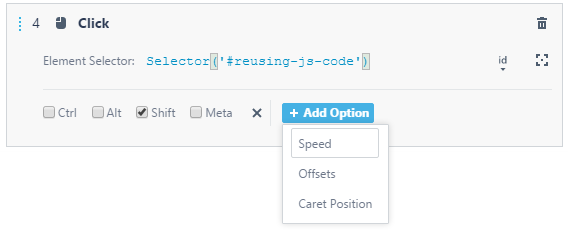

# Action Options

This topic describes [on-page actions](README.md) options.

* [Basic Action Options](#basic-action-options)
* [Mouse Action Options](#mouse-action-options)
* [Drag To Element Action Options](#drag-to-element-action-options)
* [Click Action Options](#click-action-options)
* [Type Text Action Options](#type-text-action-options)

To set up options, click the **Add Option** button in the action parameters area and select a desired option in the list.

If you do not set up the options, their default values are used during test execution.

TestCafe Studio automatically sets up some options when you record on-page actions by interacting with a webpage.

## Basic Action Options

The following option is available for the [Press Key](README.md#press-key),
[Select Text](README.md#select-text), [Select Text Area Content](README.md#select-text-area-content) and
[Select Editable Content](README.md#select-editable-content) actions.

Option | Type   | Description | Default
--------- | ------ | ----------------------------------------------------------------------------------- | -----
*Speed*   | Number | The speed of action emulation. Defines how fast TestCafe Studio performs the action when running tests. A number between `1` (the maximum speed) and `0.01` (the minimum speed). If a test speed is also specified in [run configuration settings](../../../../user-interface/run-configurations-dialog.md), the action speed setting overrides the test speed. | `1`

## Mouse Action Options

The following options are available for mouse actions: [Drag](README.md#drag) and [Hover](README.md#hover).

Option                      | Type    | Description | Default
------------------------------ | ------- |-----------------------------------------------------------------------------------------------------------------------  | -----
*Modifiers*:&nbsp;*Ctrl*,&nbsp;*Alt*,&nbsp;*Shift*,&nbsp;*Meta*  | Boolean | Indicate which modifier keys should be pressed during the mouse action. | Disabled
*Offsets*: *OffsetX*, *OffsetY*           | Number  | Mouse pointer coordinates that define a point where the action is performed. If an offset is a positive integer, coordinates are calculated relative to the top-left corner of the target element. If an offset is a negative integer, they are calculated relative to the bottom-right corner. If you record the action by performing it on the web page, TestCafe Studio remembers the *OffsetX* and *OffsetY* parameters' values, but not to use them in the action. To use these values, click the **Add Options** button and select **Offsets** in the list. The options with the recorded values are added. | The center of the target element.
*Speed*   | Number | The speed of action emulation. Defines how fast TestCafe Studio performs the action when running tests. A number between `1` (the maximum speed) and `0.01` (the minimum speed). If a test speed is also specified in [run configuration settings](../../../../user-interface/run-configurations-dialog.md), the action speed setting overrides the test speed. | `1`

## Drag To Element Action Options

The following options are available for the [Drag To Element](README.md#drag-to-element) action.

Option                      | Type    | Description | Default
------------------------------ | ------- | --------------------------------------------------------------------------------------------------------------------------- | -----
*Modifiers*:&nbsp;*Ctrl*,&nbsp;*Alt*,&nbsp;*Shift*,&nbsp;*Meta* | Boolean | Indicate which modifier keys should be pressed during the drag action. | Disabled
*Offsets*: *OffsetX*, *OffsetY*        | Number  | Mouse pointer coordinates that define a point where dragging is started. If an offset is a positive integer, coordinates are calculated relative to the top-left corner of the target element. If an offset is a negative integer, they are calculated relative to the bottom-right corner. If you record the action by performing it on the web page, TestCafe Studio remembers the *OffsetX* and *OffsetY* parameters' values, but not to use them in the action. To use these values, click the **Add Options** button and select **Offsets** in the list. The options with the recorded values are added. | The center of the target element.
*Speed*   | Number | The speed of action emulation. Defines how fast TestCafe Studio performs the action when running tests. A number between `1` (the maximum speed) and `0.01` (the minimum speed). If a test speed is also specified in [run configuration settings](../../../../user-interface/run-configurations-dialog.md), the action speed setting overrides the test speed. | `1`

## Click Action Options

The following options are available for click actions: [Click](README.md#click), [Double Click](README.md#double-click) and [Right Click](README.md#right-click).

Option                      | Type    | Description | Default
------------------------------ | ------- | ------------------------------------------------------------------------------------------------------------- | -----
*Modifiers*:&nbsp;*Ctrl*,&nbsp;*Alt*,&nbsp;*Shift*,&nbsp;*Meta* | Boolean | Indicate which modifier keys should be pressed during the mouse action. | Disabled
*Offsets*: *OffsetX*, *OffsetY*           | Number  | Mouse pointer coordinates that define a point where the action is performed. If an offset is a positive integer, coordinates are calculated relative to the top-left corner of the target element. If an offset is a negative integer, they are calculated relative to the bottom-right corner. If you record the action by performing it on the web page, TestCafe Studio remembers the *OffsetX* and *OffsetY* parameters' values, but not to use them in the action. To use these values, click the **Add Options** button and select **Offsets** in the list. The options with the recorded values are added. | The center of the target element.
*Caret Position*                     | Number  | The initial caret position if the action is performed on a text input field. A zero-based integer. | The length of the input field content.
*Speed*   | Number | The speed of action emulation. Defines how fast TestCafe Studio performs the action when running tests. A number between `1` (the maximum speed) and `0.01` (the minimum speed). If a test speed is also specified in [run configuration settings](../../../../user-interface/run-configurations-dialog.md), the action speed setting overrides the test speed. | `1`

## Type Text Action Options

The following options are available for the [Type Text](README.md#type-text) action.

Option                      | Type    | Description | Default
------------------------------ | ------- | --------------------------------------------------------------------------------------------------------------------- | -----
*Modifiers*:&nbsp;*Ctrl*,&nbsp;*Alt*,&nbsp;*Shift*,&nbsp;*Meta* | Boolean | Indicate which modifier keys should be pressed while typing. | Disabled
*Offsets*: *OffsetX*, *OffsetY*           | Number  | Mouse pointer coordinates that define a point where the action is performed. If an offset is a positive integer, coordinates are calculated relative to the top-left corner of the target element. If an offset is a negative integer, they are calculated relative to the bottom-right corner. If you record the action by performing it on the web page, TestCafe Studio remembers the *OffsetX* and *OffsetY* parameters' values, but not to use them in the action. To use these values, click the **Add Options** button and select **Offsets** in the list. The options with the recorded values are added. |  The center of the target element.
*Caret Position*                     | Number  | The initial caret position. A zero-based integer. | The length of the input field content.
*Replace*                      | Boolean | Enable the option to remove the current text in the target element, or disable it to leave the text as it is. | Disabled
*Paste*                        | Boolean | Enable the option to insert the entire block of current text in a single keystroke (similar to a copy & paste function), or disable it to insert the current text character by character. | Disabled
*Speed*   | Number | The speed of action emulation. Defines how fast TestCafe Studio performs the action when running tests. A number between `1` (the maximum speed) and `0.01` (the minimum speed). If a test speed is also specified in [run configuration settings](../../../../user-interface/run-configurations-dialog.md), the action speed setting overrides the test speed. | `1`