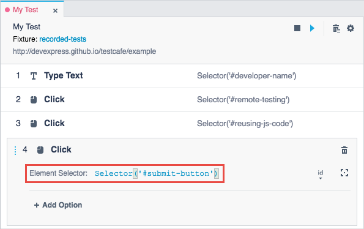
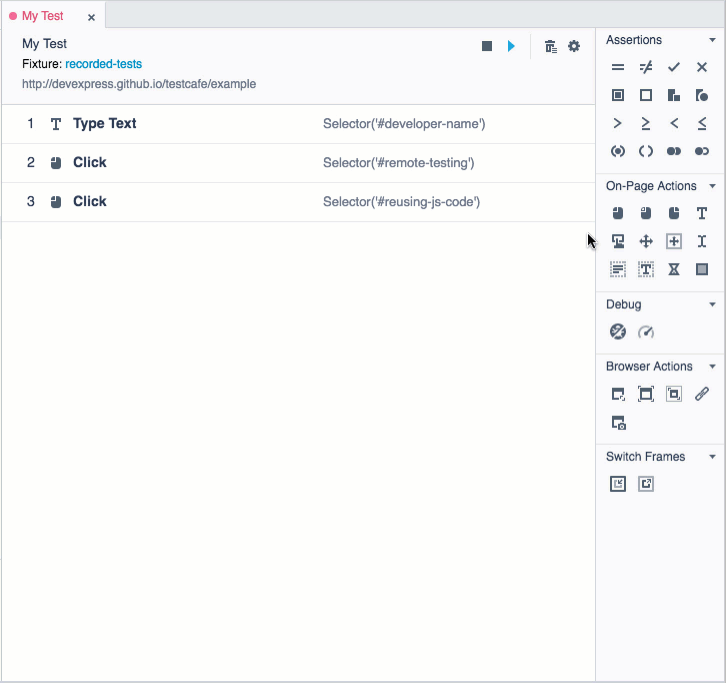

# Action Parameters

## Element Selector

Most of the on-page actions have the *Element Selector* parameter that specifies a target element. This parameter accepts a [Selector](https://devexpress.github.io/testcafe/documentation/test-api/selecting-page-elements/selectors/) function that returns a webpage element.

You can set up the *Element Selector* parameter in one of the following ways:

* **Use an automatically generated selector**

    When you interact with a webpage during recording, TestCafe Studio records test actions, automatically generates an element selector for each target element and adds the selector to the **Element Selector** field.

    

    TestCafe Studio produces a set of selectors for a target element. You can view them in in the **Element Selector** drop-down list and pick the one that fits you best.

    

* **Generate a selector by picking an element on a webpage**

    If you add an on-page action to a test from the *Actions* panel during recording, you can select a target element on the tested webpage using an element picker. To do this, click the  button next to the **Element Selector** field, then pick the element on the webpage. TestCafe Studio generates the element selector and fills the **Element Selector** field with it. You can view other available selectors in the **Element Selector** drop-down list.

    

* **Enter a Selector function manually**

## Other Parameters

For information on other parameters, see [on-page action description](README.md).
