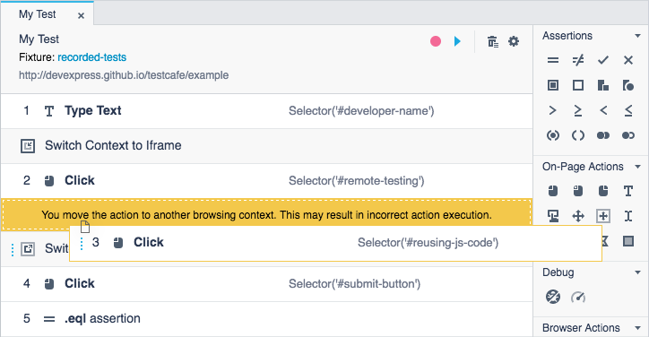

# Switch Frames

The **Switch Frames** category contains actions that allows you to switch the test's [browsing context](https://html.spec.whatwg.org/multipage/browsers.html#windows) to iframes or back to the main window.

*  [Switch Context to Iframe](#switch-context-to-iframe)
*  [Switch Context to Main Window](#switch-context-to-main-window)

When you interact with an iframe on the webpage during recording, TestCafe Studio automatically adds the **Switch Frames** actions to the test.

## Switch Context to Iframe

The **Switch Context to iframe** action switches the test's browsing context to a specified iframe. TestCafe Studio performs the subsequent test actions in this iframe until reaches the [Switch Context to Main Window](#switch-to-main-window) action in the test.

Parameter | Type  | Description
--------- | ----- | -------------
*Element&nbsp;Selector* | Selector | Identifies an iframe on the tested page. The parameter accepts a [Selector](https://devexpress.github.io/testcafe/documentation/test-api/selecting-page-elements/selectors/) function that returns the iframe. For more information on how to set up this parameter, see [Element Selector](on-page-actions/action-parameters#element-selector).

## Switch Context to Main Window

The **Switch Context to Main Window** action switches the test's browsing context from an iframe back to the main window.

> Be careful when you reorder the **Switch Frames** actions or move test actions between browsing contexts. TestCafe Studio shows warnings in these cases. After dragging, make sure the actions relate to appropriate contexts. Otherwise, they may be executed incorrectly.

