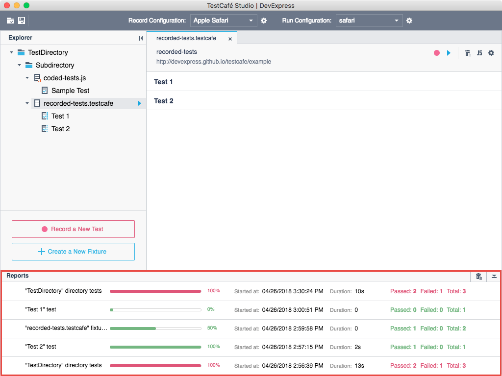
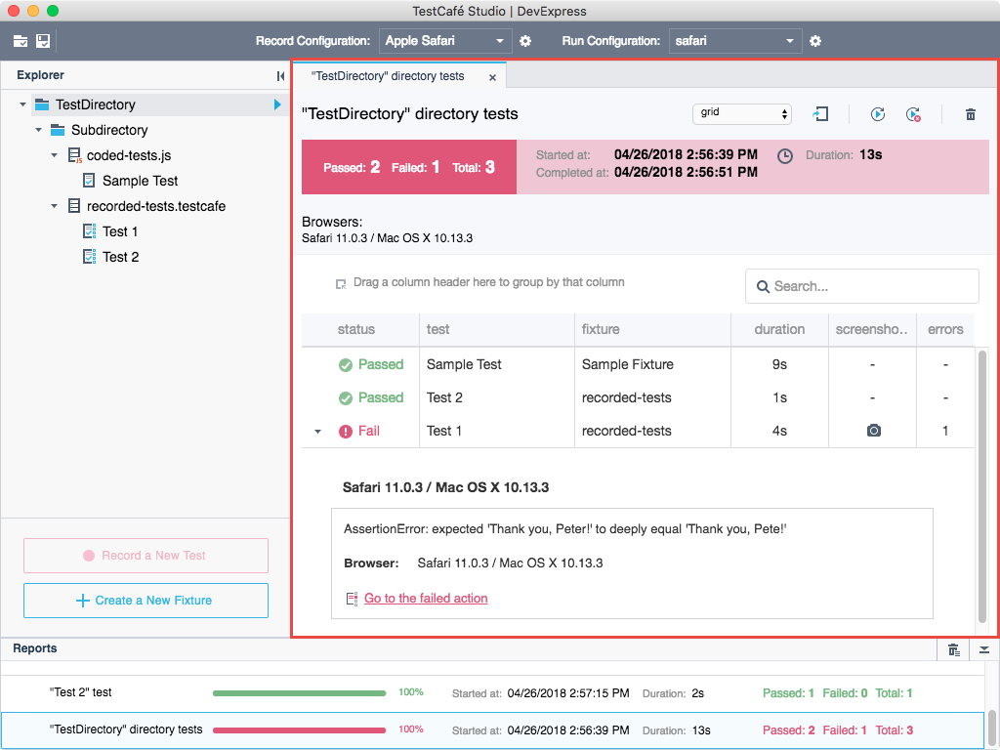

# Reports

You can view test results in the **Reports** panel. Each row in the panel corresponds to an individual test run. The test run can contain a single test, a group of tests from different fixtures, fixture tests or directory tests.

You can view the following information for each test run: the progress, start time, duration and the number of tests that have failed and passed. Different colors indicates the test's status: green - passed tests, red - failed tests.

You can click the test run's row in the **Reports** panel to see detailed results. This opens the **Report tab** with a full report that contains the overall results and details for each executed test. You can see additional information for failed tests: failed actions, what caused them, links to these actions and screenshots.

You can sort, group and filter the data. You can also view the report in various formats and export it. See the **Report Tab**'s description for more information.
