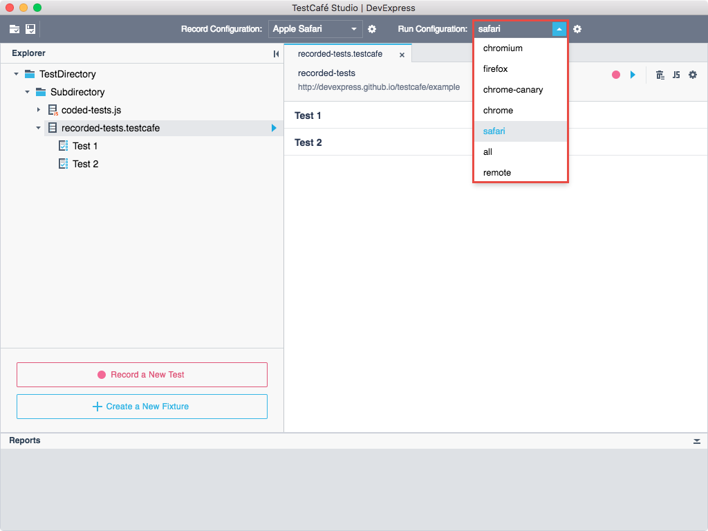
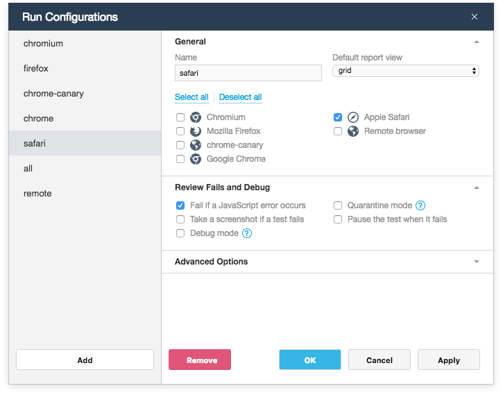
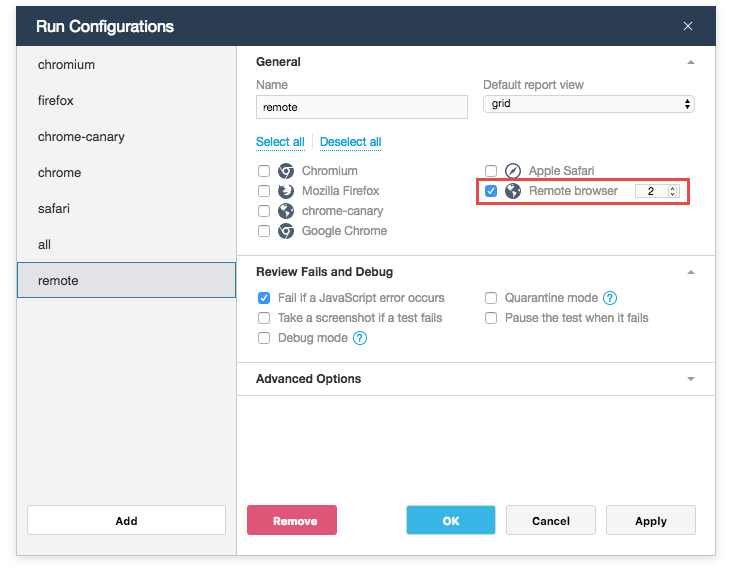
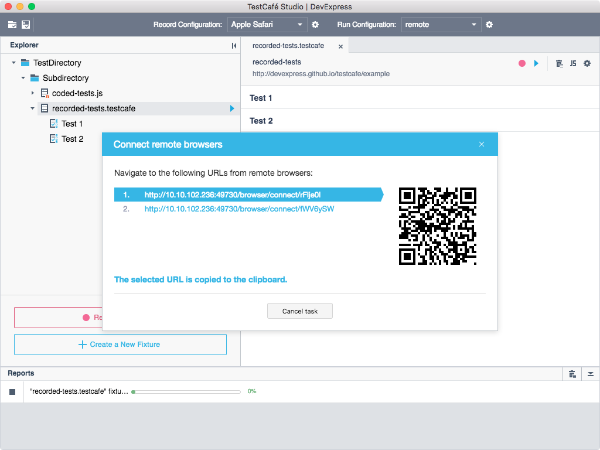
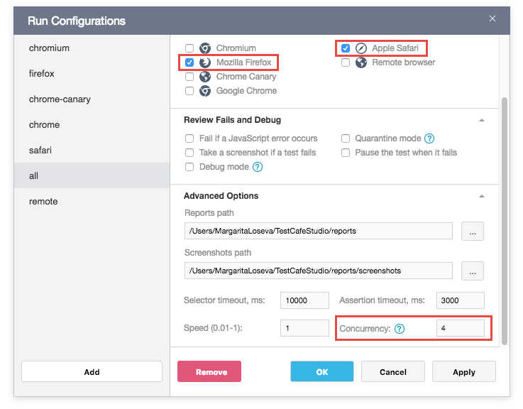

# Running Tests

This topic describes how to execute tests and consists of the following sections:

* [Run Configurations](#run-configurations)
* [Starting and Stopping Tests](#starting-and-stopping-tests)
* [Running Tests in Remote Browsers](#running-tests-in-remote-browsers)

## Run Configurations

TestCafe Studio can run tests in all desktop and mobile browsers (with or without a UI). It determines which browsers are installed on the local computer and automatically creates *run configurations* for them. You can view available configurations and switch between them in the **Run Configuration** drop-down menu.

To modify configurations or create a new one, click the  button and use the [Run Configurations](../user-interface/run-configurations-dialog.md) dialog. You can select one or multiple browsers and specify options that affect test execution for each configuration.

## Starting and Stopping Tests

> Important! Before running tests, select the run configuration from the **Run Configuration** list.

You can run an entire test directory/subdirectory, a specific fixture, an individual test or a coded test file using the  button. This button is available in the **Test Editor**, **Fixture Editor** and **Explorer** panel.

**To run the entire test directory or subdirectory**, click the  **Run all tests** button next to the directory in the Explorer panel.

**To run a fixture**, click the  **Run all tests** button next to the fixture in the **Explorer** panel or on the **Fixture Editor**'s toolbar.

**To run an individual test**, do any of the following:

* Click the  **Run test** button on the **Test Editor** toolbar.
* Click the  **Run test** button next to the test in the **Fixture Editor** or **Explorer** panel.

**To run a coded test's file**, click the  **Run test** button next to the file in the **Explorer** panel. You can also run test fixtures and individual tests from the **Code Editor** by clicking the  button.

**To run several tests** from different fixtures and directories, select desired tests in the **Explorer** panel with Ctrl-click, then select **Run tests** from the context menu.

After starting a test run, TestCafe Studio launches the specified browsers and executes tests in them simultaneously. The **Reports** panel displays the tests' progress.

Click the  button in the **Reports** panel **to stop the test**.

TestCafe Studio pauses the test when it fails if the *Pause the test when it failes* option is enabled in the run configuration. To finish the test, click the **Finish** button in the browser window.

## Running Tests in Remote Browsers

TestCafe Studio allows you to run tests on any device that has network access to the machine where TestCafe Studio is installed.

Follow the steps below to run a test in remote browsers:

1. Create a run configuration for the remote browsers. In the run configuration's settings, select the **Remote browser** checkbox and specify the number of remote browsers.

    

2. Select the configuration in the **Run Configuration** list.
3. Start the test run by clicking the **Run test** button. TestCafe provides URLs to open in the remote browsers which you want to test. When you open these URLs, the browser connects to the TestCafe Studio server and starts testing.

## Concurrent Test Execution

To save time spent on testing, TestCafe allows you to execute tests concurrently. *Concurrency* is an optional mode that allows you to invoke multiple instances of the same browser. These instances constitute the pool of browsers against which tests run concurrently, i.e. each test runs in the first free instance.

To enable concurrency and specify a number of browser instances, use the **Concurrency** option of the run configuration's settings.

> Concurrent test execution is not supported in Microsoft Edge. This is because there is no known way to start Edge in a new window and make it open a particular URL.

You can also use concurrency when testing against multiple browsers.

In this case, tests are distributed across four Safari instances and the same tests also run in four Firefox instances.

If you test against multiple [remote browsers](#running-tests-in-remote-browsers), open and connect all instances of one browser before you connect the next browser.