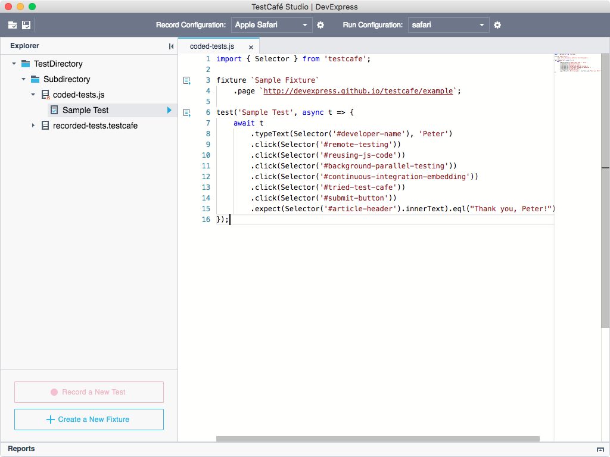
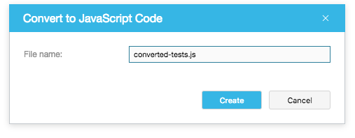

# Writing Test Code

TestCafe Studio allows you to write tests using JavaScript and TypeScript. It provides a powerful **Code Editor** with syntax highlight, code completion, parameter hints, etc.

Follow the steps below to write test code from scratch:

1. Create a `.js` or `.ts` file in a [test directory](organizing-tests.md#test-directory) or subdirectory by right-clicking the directory in the **Explorer** panel and selecting **New File** from the context menu. In the **New File** dialog, specify the file name and click **Create**. TestCafe Stuido creates the test file and opens it in the **Code Editor**.

2. Write the test code. See the [Test API](https://devexpress.github.io/testcafe/documentation/test-api/) topic in the open-source TestCafe documentation for information about the API used in tests.

    

## Converting Recorded Tests to JavaScript Code

You can convert recorded tests to JavaScript code. This gives you more control and flexibility in your test.

To convert a test fixture with recorded tests to code:

1. Select the fixture in the **Explorer** panel and select **Convert to JavaScript Code** from the context menu.

2. In the subsequent dialog, specify a name of the file where the test code should be added.

    

TestCafe Studio creates the `.js` file with tests in the same test directory and displays it in the **Explorer** panel.